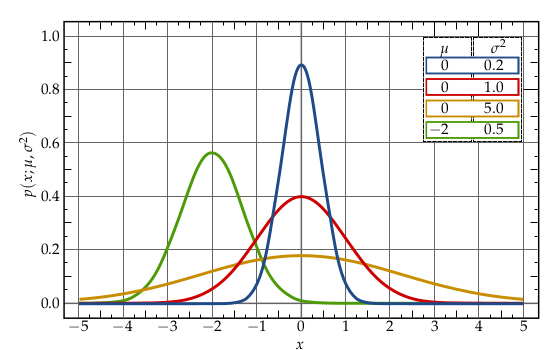
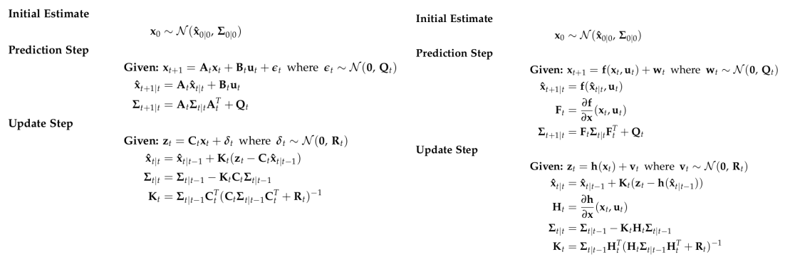
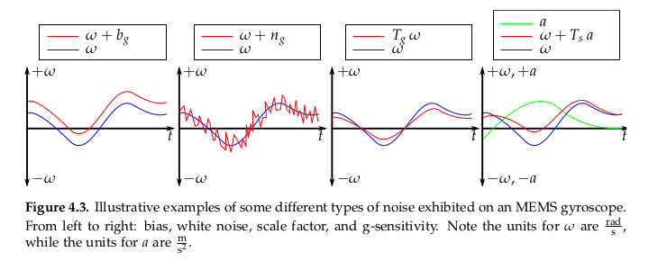
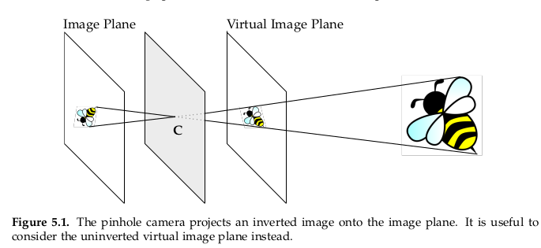
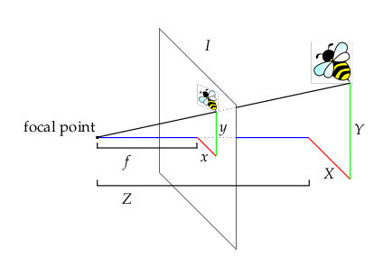
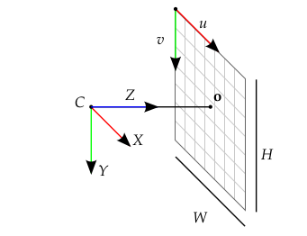
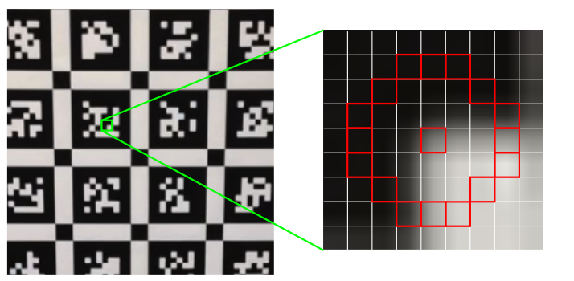
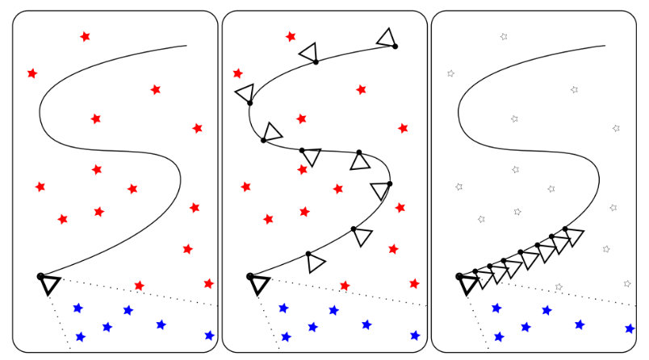
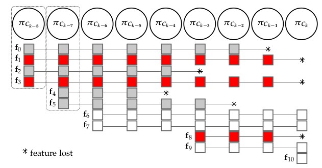

<center> <font color='green' size='15'> MSCKF-VIO Tutorial</font> </center>

# 1 符号表示

|          基本符号           |              例子               |
| :-------------------------: | :-----------------------------: |
|            标量             |               $x$               |
|            向量             |          $\mathbf{x}$           |
|            矩阵             |          $\mathbf{A}$           |
|      连续时间一阶导数       | $\dot{\mathbf{v}} = \mathbf{a}$ |
|      尖冒号表示估计值       |       $\hat{\mathbf{x}}$        |
|         单位四元数          |       $\bar{\mathbf{q}}$        |
|           坐标系            |            B 或者{B}            |
|   坐标系内点用左上方表示    |       $^{G} {\mathbf{p}}$       |
| 坐标系A$\rightarrow$坐标系B |      $_{A}^{B} \mathbf{R}$      |


|        误差符号        |                             例子                             |
| :--------------------: | :----------------------------------------------------------: |
| $\Delta$：两个向量误差 |     $\Delta \mathbf{p} = \mathbf{p} - \hat{\mathbf{p}}$      |
|  $\delta$：四元数误差  |       $\delta \mathbf{\theta} \quad \delta \mathbf{q}$       |
|  波浪号表示一般性误差  | $\tilde{\mathbf{x}} =\mathbf{x} -  \hat{\mathbf{x}} \quad with \quad \mathbf{x} = (\mathbf{p}, \mathbf{\theta})^{T}$ |


* G : 世界坐标系
* C : 相机坐标系
* B : 机体坐标系

# 2 概率状态估计

## 2.1 概率论基础


$P(x = X)$ 在某个范围内的概率等于 概率密度函数$p(x)$ 在该范围内的积分
$$
Pr(a \le x \le b) = \int_{a}^{b} p(x) dx \tag{1}
$$


均值和方差

* $\mathbb{E}(x) = \int x p(x) dx$   
* $Var(x) = \mathbb{E}[x - \mathbb{E}(x)^2] = \sigma^2$


## 2.2 高斯分布

一维高斯密度函数
$$
p(x; \mu, \sigma) = \frac{1}{\sqrt{2 \pi \sigma^2}} exp
\left\{ 
	-\frac{(x- \mu)^2}{2\sigma^2}
\right\} \tag{2}
$$


$N$维高斯密度函数
$$
p(\mathbf{x}; \mathbf{\mu}, \mathbf{\Sigma}) =
\frac{1}{\sqrt{(2\pi)^2|\mathbf{\Sigma}|}} exp
\left\{ 
	-\frac{1}{2} (\mathbf{x}- \mathbf{\mu})^T\Sigma^{-1}(\mathbf{x}- \mathbf{\mu})
\right\} \tag{3}
$$
其中：
$$
\begin{aligned}
	Cov(\mathbf{x}, \mathbf{y}) &= \mathbb{E[(\mathbf{x} - \mathbb{E(x)})(\mathbf{y} - \mathbb{E(y)})]}
\\

Cov\left(\begin{bmatrix}
	x_1 \\
	x_2 \\
	\vdots \\
	x_n
\end{bmatrix}
\right) &=
\begin{bmatrix}
	\sigma_{x_1}^2 & \rho_{(x_1, x_2)}\sigma_{x_1}\sigma_{x_2} & \dots & \rho_{(x_1, x_n)}\sigma_{x_1}\sigma_{x_n}  \\
	\rho_{(x_2, x_1)}\sigma_{x_2}\sigma_{x_1} & \sigma_{x_2}^2 & \dots & \rho_{(x_2, x_n)}\sigma_{x_2}\sigma_{x_n}  \\
	\vdots & \vdots & \ddots & \vdots  \\
	\rho_{(x_n, x_1)}\sigma_{x_n}\sigma_{x_1} &  \rho_{(x_n, x_2)}\sigma_{x_n}\sigma_{x_2} & \dots  & \sigma_{x_n}^2
\end{bmatrix}
\end{aligned} \tag{4}
$$


## 2.3 条件高斯

$$
\begin{bmatrix}
	\mathbf{x} \\
	\mathbf{y} 
\end{bmatrix} =
N(\mathbf{\mu}, \mathbf{\Sigma}) =
\left(
    \begin{bmatrix}
        \mu_x \\
        \mu_y 
    \end{bmatrix},
    \begin{bmatrix}
        \Sigma_{xx} & \Sigma_{xy} \\
        \Sigma_{yx} & \Sigma_{yy} 
    \end{bmatrix}
\right) \tag{5}
$$

边缘化
$$
p(x) = \int p(x,y) dy
	 = \int p(x|y) p(y)dy = N(\mu_x, \Sigma_{xx})
$$
条件概率
$$
p\left(
    \begin{bmatrix}
        x \\
        y 
    \end{bmatrix}
\right) 
=
N\left(
    \begin{bmatrix}
        \mu_x \\
        \mu_y 
    \end{bmatrix},
    \begin{bmatrix}
        \Sigma_{xx} & \Sigma_{xy} \\
        \Sigma_{yx} & \Sigma_{yy} 
    \end{bmatrix}
\right)
=
N\left(
    \begin{bmatrix}
        \mu_x \\
        A\mu_x + b 
    \end{bmatrix},
    \begin{bmatrix}
        \Sigma_{xx} & \Sigma_{xx}A^T \\
        A\Sigma_{xx} & A\Sigma_{xx}A^T + Q 
    \end{bmatrix}
\right) \tag{6}
$$
其中：

* $ \mathbf{x} \sim N(\mu_x, \Sigma_{xx})$
* $y = Ax + b, \quad b \sim N(0, Q)$

# 3 卡尔曼滤波

## 3.1 卡尔曼滤波

初始状态估计
$$
\mathbf{x_0} \sim N(\hat{\mathbf{x}}_{0|0}, \mathbf{\Sigma}_{0|0})
$$
预测
$$
\mathbf{Given}: \mathbf{x}_{t+1} = \mathbf{A}_{t}\mathbf{x}_{t} + \mathbf{B}_{t}\mathbf{u}_{t} + \mathbf{\epsilon}_{t} \quad \mathbf{\epsilon}_{t} \sim N(\mathbf{0}, \mathbf{Q}_t)
\\
\begin{aligned}
	\hat{\mathbf{x}}_{t+1|t} &= \mathbf{A}_{t|t}\hat{\mathbf{x}}_{t} + \mathbf{B}_{t}\mathbf{u}_{t} \\
	\hat{\mathbf{\Sigma}}_{t+1|t} &= \mathbf{A}_{t}\hat{\mathbf{\Sigma}}_{t}\mathbf{A}_{t}^T + \mathbf{Q}_{t}

\end{aligned}
$$
更新
$$
\mathbf{Given}: \mathbf{x}_{t} = \mathbf{C}_{t}\mathbf{x}_{t} + 	\mathbf{\epsilon}_{t} \quad \mathbf{\delta}_{t} \sim N(\mathbf{0}, \mathbf{R}_t)
\\
\begin{aligned}
	\hat{\mathbf{x}}_{t|t} &= \hat{\mathbf{x}}_{t|t-1} + \mathbf{K}_{t}(\mathbf{z}_t - C_t\hat{\mathbf{x}}_{t|t-1}) \\
	\mathbf{\Sigma}_{t|t} &= \mathbf{\Sigma}_{t|t-1} - K_t C_t \mathbf{\Sigma}_{t|t-1} \\
	\mathbf{K}_{t} &= \mathbf{\Sigma}_{t|t-1}C_t^T(C_t\mathbf{\Sigma}_{t|t-1}C_t^T + R_t)^{-1}

\end{aligned}
$$

## 3.2 扩展卡尔曼滤波EKF

系统动态模型
$$
\begin{aligned}
	\mathbf{x}_{t+1} &= f(\mathbf{x}_t, \mathbf{u}_t, \mathbf{w}_t) \quad \mathbf{w}_t \sim N(\mathbf{0}, Q_t) \\
	\mathbf{z}_t &= h(\mathbf{x}_t, \mathbf{v}_t) \quad \quad  \mathbf{v}_t \sim N(\mathbf{0}, R_t)

\end{aligned}
$$
泰勒公式
$$
f(x) = \frac{f(x_0)}{0!} + \frac{f^{\prime}(x_0)}{1!}(x- x_0) + \frac{f^{\prime{\prime}}(x_0)}{2!}(x- x_0)^2 + \cdots + \frac{f^{(n)}(x_0)}{n!}(x- x_0)^n + R_n(x)
$$





# 4 IMU


## 4.1 Accelerometers(加速计)

$$
^B \mathbf{a}_m = \mathbf{T}_a {_G^B}\mathbf{R}(^G\mathbf{a} - ^G\mathbf{g}) + \mathbf{n}_a + \mathbf{b}_a
$$

其中：

* $\mathbf{T}_a$: 加速度计测量中导致未对准和比例误差的矩阵系数
* $^G\mathbf{a}$: 全局坐标系中 IMU 的真实加速度，{ B } 表示惯性体（IMU）坐标系。
* $^G\mathbf{g}: \quad \mathbf{g} = (0, 0, -1)^T$  

* $\mathbf{n}_a \sim N(0, N_a)$
* $\mathbf{b}_a：$ 随时间变化，建模为随机游走过程噪声$n_{wa} \sim N(0,N_{wa} )$

## 4.2 Gyroscope(陀螺仪)


$$
^B \mathbf{\omega}_m = \mathbf{T}_g \omega +\mathbf{T}_s ^B\mathbf{a} + \mathbf{n}_g + \mathbf{b}_g
$$
其中：

* $\mathbf{n}_g \sim N(0, N_g)$

* $\mathbf{b}_g：$ 随时间变化，建模为随机游走过程噪声$n_{wg} \sim N(0,N_{wg} )$


## 4.3 Noise and Bias Characteristics(噪声和零偏特性)

$$
\sigma_{a_c} = \sigma_{a_d} \sqrt{\Delta t}
$$

同样，随机游走偏差标准差也必须转换为连续值。
$$
\sigma_{wa_c} = \frac{\sigma_{wa_d}}{\sqrt{\Delta t}}
$$

## 4.4 运动模型

$$
\tilde{\mathbf{X}}_{IMU} = \mathbf{F} \tilde{{X}}_{IMU} + \mathbf{G} \mathbf{n}_{IMU}
$$


  矩阵形式
$$
\begin{aligned}
	\begin{bmatrix}
		\dot{\delta{\theta}}_{I} \\
		\dot{\tilde{b}}_{g}  \\
		^{G}\dot{\tilde{b}}_{g} 
	\end{bmatrix}

\end{aligned}
$$


![[公式]](https://www.zhihu.com/equation?tex=%5Cbegin%7Baligned%7D%5Cunderbrace%7B%5Cleft%5B%5Cbegin%7Bmatrix%7D%5Cdot%7B%5Cdelta+%5Ctheta%7D_I%5C%5C%5Cdot%7B%5Ctilde+b%7D_g%5C%5C%5Csideset%7B%5EG%7D%7B_I%7D%7B%5Cdot%7B%5Ctilde+v%7D%7D%5C%5C%5Cdot%7B%5Ctilde+b%7D_a%5C%5C%5Csideset%7B%5EG%7D%7B_I%7D%7B%5Cdot%7B%5Ctilde+p%7D%7D%5Cend%7Bmatrix%7D%5Cright%5D%7D_%7B%5Cdot%7B%5Ctilde+X%7D_%7BIMU%7D%7D%3D%26%5Cquad%5Cunderbrace%7B%5Cleft%5B%5Cbegin%7Bmatrix%7D-%5Clfloor%5Chat+%5Comega_%7B%5Ctimes%7D%5Crfloor%26-I_3%260_%7B3%5Ctimes3%7D%260_%7B3%5Ctimes3%7D%260_%7B3%5Ctimes3%7D%5C%5C0_%7B3%5Ctimes3%7D%260_%7B3%5Ctimes3%7D%260_%7B3%5Ctimes3%7D%260_%7B3%5Ctimes3%7D%260_%7B3%5Ctimes3%7D%5C%5C-%7BC%7D%5Cleft%28%5Csideset%7B%5EI_G%7D%7B%7D%7B%5Chat+q%7D%5Cright%29%5ET%5Clfloor+%5Chat+a_%7B%5Ctimes%7D%5Crfloor%260_%7B3%5Ctimes3%7D%260_%7B3%5Ctimes3%7D%26-%7BC%7D%5Cleft%28%5Csideset%7B%5EI_G%7D%7B%7D%7B%5Chat+q%7D%5Cright%29%5ET%260_%7B3%5Ctimes3%7D%5C%5C0_%7B3%5Ctimes3%7D%260_%7B3%5Ctimes3%7D%260_%7B3%5Ctimes3%7D%260_%7B3%5Ctimes3%7D%260_%7B3%5Ctimes3%7D%5C%5C0_%7B3%5Ctimes3%7D%260_%7B3%5Ctimes3%7D%26I_3%260_%7B3%5Ctimes3%7D%260_%7B3%5Ctimes3%7D%5Cend%7Bmatrix%7D%5Cright%5D%7D_F%5Cunderbrace%7B%5Cleft%5B%5Cbegin%7Bmatrix%7D%5Cdelta+%5Ctheta_I%5C%5C%5Ctilde+b_g%5C%5C%5Csideset%7B%5EG%7D%7B_I%7D%7B%5Ctilde+v%7D%5C%5C%5Ctilde+b_a%5C%5C%5Csideset%7B%5EG%7D%7B_I%7D%7B%5Ctilde+p%7D%5Cend%7Bmatrix%7D%5Cright%5D%7D_%7B%5Ctilde+X_%7BIMU%7D%7D%5C%5C%26%2B%5Cquad%5Cunderbrace%7B%5Cleft%5B%5Cbegin%7Bmatrix%7D-I_3%260_%7B3%5Ctimes3%7D%260_%7B3%5Ctimes3%7D%260_%7B3%5Ctimes3%7D%5C%5C0_%7B3%5Ctimes3%7D%26I_3%260_%7B3%5Ctimes3%7D%260_%7B3%5Ctimes3%7D%5C%5C0_%7B3%5Ctimes3%7D%260_%7B3%5Ctimes3%7D%26-%7BC%7D%5Cleft%28%5Csideset%7B%5EI_G%7D%7B%7D%7B%5Chat+q%7D%5Cright%29%5ET%260_%7B3%5Ctimes3%7D%5C%5C0_%7B3%5Ctimes3%7D%260_%7B3%5Ctimes3%7D%260_%7B3%5Ctimes3%7D%26I_3%5C%5C0_%7B3%5Ctimes3%7D%260_%7B3%5Ctimes3%7D%260_%7B3%5Ctimes3%7D%260_%7B3%5Ctimes3%7D%5Cend%7Bmatrix%7D%5Cright%5D%7D_G%5Cunderbrace%7B%5Cleft%5B%5Cbegin%7Bmatrix%7Dn_g%5C%5Cn_%7Bwg%7D%5C%5Cn_a%5C%5Cn_%7Bwa%7D%5Cend%7Bmatrix%7D%5Cright%5D%7D_%7Bn_%7BIMU%7D%7D%5Cend%7Baligned%7D%5C%5C)


# 5 Computer Vision

## 5.1 Pinhole Camera Model(针孔模型)


$$
\begin{aligned}
	x = f_x \frac{X}{Z}  \\
	y = f_y \frac{Y}{Z}
\end{aligned}
$$
**相机投影**



$$
\begin{aligned}
	x = f_x \frac{X}{Z} + c_x \\
	y = f_y \frac{Y}{Z} + c_y
\end{aligned}
$$



$$
\mathbf{h}
\begin{pmatrix}
	X \\
	Y \\
	Z
\end{pmatrix} =
\begin{bmatrix}
	f_x &   0 \\
	0   & f_y 
\end{bmatrix}
\begin{bmatrix}
	\frac{X}{Z} \\
	\frac{Y}{Z}
\end{bmatrix} +
\begin{bmatrix}
	c_x \\
	c_y 
\end{bmatrix}
$$
**图像畸变失真**
$$
\begin{aligned}
	\mathbf{h}
    \begin{pmatrix}
        X \\
        Y \\
        Z
    \end{pmatrix} &=
    \begin{bmatrix}
        f_x &   0 \\
        0   & f_y 
    \end{bmatrix}
    \begin{pmatrix}
    	d_r
    	\begin{bmatrix}
    		u \\
    		v
    	\end{bmatrix}
    	+ d_t
    \end{pmatrix} +
    \begin{bmatrix}
        c_x \\
        c_y 
    \end{bmatrix}
    \\
    d_r &= (1 + k_1r + k_2r^2 + k_3r^3) \\
    d_t &= 
    \begin{bmatrix}
        2uvt_1 + (r+2u^2)t_2 \\
        2uvt_2 + (r+2v^2)t_1 
    \end{bmatrix}
    \\
    
    with \quad u &= \frac{X}{Z}, v = \frac{Y}{Z}, r = u^2 + v^2
    
\end{aligned}
$$
**Frame Transformation**
$$
\begin{bmatrix}
    u \\
    v
\end{bmatrix}
=
\mathbf{h}(_G^C\mathbf{R}(^G\mathbf{x} - ^G\mathbf{p}_C))
$$
**Triangulation（三角化）**


$C_0$帧是第一次观察到该点的相机帧，该点在第$i$个相机$C_i$帧中的位置如下。
$$
\begin{aligned}
	^{C_i}\mathbf{p}_f &= _{C_0}^{C_i}\mathbf{R}(^{C_0}\mathbf{p}_f - ^{C_0}\mathbf{p}_{C_{i}}) \\
	^{C_i}\mathbf{p}_f &= _{C_0}^{C_i}\mathbf{R} ^{C_0}\mathbf{p}_f + ^{C_i}\mathbf{p}_{C_{0}}
\end{aligned}
$$
这可以用逆深度参数化重写，以提高数值稳定性并帮助避免局部最小值
$$
\begin{aligned}
	^{C_i}\mathbf{p}_f &= _{C_0}^{C_i}\mathbf{R} ^{C_0}\mathbf{p}_f + ^{C_i}\mathbf{p}_{C_{0}} \\
	& = _{C_0}^{C_i}\mathbf{R} ^{C_0}
	\begin{bmatrix} 
		c_n X \\
		c_n Y \\
		c_n Z
	\end{bmatrix}
	+ ^{C_i}\mathbf{p}_{C_{0}} \\
	&= ^{C_0} Z
	\begin{pmatrix} 
		_{C_0}^{C_i}\mathbf{R} 
		\begin{bmatrix}
			\frac{^{C_0}X}{^{C_0}Z} \\
			\frac{^{C_0}Y}{^{C_0}Z} \\
			1
		\end{bmatrix} +
		\frac{1}{^{C_0}Z} ^{C_i} \mathbf{p}_{C_{0}}
	\end{pmatrix} \\
	&= ^{C_0} Z
	\begin{pmatrix} 
		_{C_0}^{C_i}\mathbf{R}
		\begin{bmatrix}
			\alpha \\
			\beta \\
			1
		\end{bmatrix} +
		\rho ^{C_i}\mathbf{p}_{C_{0}}
	\end{pmatrix} \\
	&= ^{C_0} Z \mathbf{g}_i
	\begin{pmatrix} 
		\alpha \\
		\beta \\
		\rho 
	\end{pmatrix}
\end{aligned}
$$
其中：

* $\alpha = \frac{^{C_0}X}{^{C_0}Z}$
* $\beta = \frac{^{C_0}Y}{^{C_0}Z}$ 
* $ \rho = \frac{1}{^{C_0}Z}$

**Gauss-Newton Minimization**
$$
\mathbf{f}_i(\mathbf{\theta}) = \mathbf{Z}_i - \mathbf{h}(\mathbf{g}_i(\mathbf{\theta})) \quad with: \quad 
\mathbf{\theta} =
	\begin{pmatrix} 
		\alpha \\
		\beta \\
		\rho 
	\end{pmatrix}
$$

$$
S(\mathbf{\theta}) = \sum_{i=1}^{n} \mathbf{f}_i(\mathbf{\theta})^2
$$

Jacobian
$$
\mathbf{J}_{\mathbf{f}} = \frac{\partial{\mathbf{f}}}{\partial{\mathbf{\theta}}} = \frac{\partial{\mathbf{\mathbf{h}}}}{\partial{\mathbf{\mathbf{g}}}} 
\frac{\partial{\mathbf{\mathbf{g}}}}{\partial{\mathbf{\mathbf{\theta}}}}
$$
其中：
$$
\frac{\partial{\mathbf{\mathbf{h}}}}{\partial{\mathbf{\mathbf{g}}}} =
\begin{bmatrix}
    f_x & 0 \\
    0 & f_y 
\end{bmatrix}
\begin{bmatrix}
    \frac{d_r}{z} + \frac{\partial{d_r}}{\partial{x}}u  + \frac{\partial{d_t}}{\partial{x}} &   \frac{\partial{d_r}}{\partial{y}}u + \frac{\partial{d_t}}{\partial{y}} &  -\frac{d_r}{z}u +  \frac{\partial{d_r}}{\partial{z}}u  + \frac{\partial{d_t}}{\partial{z}} \\
    \frac{\partial{d_r}}{\partial{x}}v + \frac{\partial{d_t}}{\partial{y}} & \frac{d_r}{z} +  \frac{\partial{d_r}}{\partial{y}}v + \frac{\partial{d_t}}{\partial{y}} &   -\frac{d_r}{z}v +  \frac{\partial{d_r}}{\partial{z}}v  + \frac{\partial{d_t}}{\partial{z}} 
\end{bmatrix}
$$

$$
\begin{aligned}
    \mathbf{g}_i(\mathbf{\theta}) 
        &= _{C_0}^{C_i}  \mathbf{R}
        \begin{bmatrix} 
            \alpha \\
            \beta \\
            \rho 
        \end{bmatrix} + \rho ^{C_i}\mathbf{p}_{C_{0}}
     \\
     \frac{\partial{\mathbf{g}_i}}{\mathbf{\theta}} &= 
     \begin{bmatrix} 
     	 \frac{\partial{\mathbf{g}_i}}{\mathbf{\alpha}} & 
     	 \frac{\partial{\mathbf{g}_i}}{\mathbf{\beta}} & 
     	 \frac{\partial{\mathbf{g}_i}}{\mathbf{\rho}}
     \end{bmatrix} 
     \\
     &=
     \begin{bmatrix} 
     	_{C_0}^{C_i}  \mathbf{R}
     	\begin{bmatrix}
     		1 \\
     		0 \\
     		0
     	\end{bmatrix} &
     	_{C_0}^{C_i}  \mathbf{R}
     	\begin{bmatrix}
     		0 \\
     		1 \\
     		0
     	\end{bmatrix} &
     	^{C_i}  \mathbf{p}_{C_{0}}
	 \end{bmatrix} 
\end{aligned}
$$
参数更新
$$
\mathbf{\theta}_i^{(s+1)} = \mathbf{\theta}_i^{(s)} -
\left(\mathbf{J}_{\mathbf{f}}^T \mathbf{J}_{\mathbf{f}} \right)^{-1}\mathbf{J}_{\mathbf{f}}^T
\mathbf{f}( \mathbf{\theta}_i^{(s)})
$$


**Feature Points**




**Feature Matching**


# 6 MSCKF

## 6.1 Overview




传统的EKF-SLAM框架中，特征点的信息会加入到特征向量和协方差矩阵里,这种方法的缺点是特征点的信息会给一个初始深度和初始协方差，如果不正确的话，极容易导致后面不收敛，出现inconsistent的情况。MSCKF维护一个pose的FIFO，按照时间顺序排列，可以称为滑动窗口，一个特征点在滑动窗口的几个位姿都被观察到的话，就会在这几个位姿间建立约束，从而进行KF的更新。如下图所示, 左边代表的是传统EKF SLAM, 红色五角星是old feature,这个也是保存在状态向量中的,另外状态向量中只保存最新的相机姿态; 中间这张可以表示的是keyframe-based SLAM, 它会保存稀疏的关键帧和它们之间相关联的地图点; 最右边这张则可以代表MSCKF的一个基本结构, MSCKF中老的地图点和滑窗之外的相机姿态是被丢弃的, 它只存了滑窗内部的相机姿态和它们共享的地图点.


**前端**


**跟踪流程**


##### **Initialization**


**trackFeatures**


**twoPointRansac**

```c++
/**
 * @brief 计算原图像帧关键点对应的矫正位置
 * @param pts1：上一时刻的关键点位置
 * @param pts2:当前时刻跟踪匹配到的关键点位置
 * @param R_p_c:根据imu信息计算得到的两个时刻相机的相对旋转信息
 * @param distortion_model,intrinsics：相机内参和畸变模型
 * @param inlier_error：内点可接受的阈值（关键点距离差）
 * @param success_probability：成功的概率
 * @return inlier_markers：内点标志位
 */
void ImageProcessor::twoPointRansac(
    const vector<Point2f>& pts1, const vector<Point2f>& pts2,
    const cv::Matx33f& R_p_c, const cv::Vec4d& intrinsics,
    const std::string& distortion_model,
    const cv::Vec4d& distortion_coeffs,
    const double& inlier_error,
    const double& success_probability,
    vector<int>& inlier_markers)
```


对极几何可约束
$$
p_2^T [t]_{\times} R p_1  = 0
$$

* $p_1 = [x_1, y_1, 1]^T$
* $p_2 = [x_2, y_2, 1]^T$

$$
\begin{bmatrix}
	x_2 & y_2 & 1
\end{bmatrix}
\begin{bmatrix}
	0 & -t_z & t_y \\
	t_z & 0 & -t_x \\
	-t_y & t_x & 0
\end{bmatrix}
\begin{bmatrix}
	x_1 \\
    y_1 \\
    1
\end{bmatrix}
= 0
$$

展开之后我们可以得到
$$
\begin{bmatrix}
	y_1 - y_2 & -(x_1 - x_2) & x_1y_2 - x_2y_1
\end{bmatrix}
\begin{bmatrix}
	t_x \\
    t_y \\
    t_z
\end{bmatrix}
= 0
$$

```c++
vector<Point2d> pts_diff(pts1_undistorted.size());
  for (int i = 0; i < pts1_undistorted.size(); ++i)
    pts_diff[i] = pts1_undistorted[i] - pts2_undistorted[i];
...  
...
MatrixXd coeff_t(pts_diff.size(), 3);
  for (int i = 0; i < pts_diff.size(); ++i) {
    coeff_t(i, 0) = pts_diff[i].y;
    coeff_t(i, 1) = -pts_diff[i].x;
    coeff_t(i, 2) = pts1_undistorted[i].x*pts2_undistorted[i].y -
      pts1_undistorted[i].y*pts2_undistorted[i].x;
}
```

至于这个模型是怎么选出来的呢? 假设一共有N个inliers点对,那么根据式(2.4)势必会得到一个$N*3 * 3*1 = N(0)$的等式.但事实上由于误差和outliers的存在,最终结果不可能为零,我们取两个点将式子分块,并且只考虑两个点的情况,那么将会有:
$$
{\color{Green} \begin{bmatrix}
y_{1}-y_{2} & -(x_{1}-x_{2}) & x_{1}y_{2}-x_{2}y_{2}\\
y_{3}-y_{4} & -(x_{3}-x_{4}) & x_{3}y_{4}-x_{4}y_{3}
\end{bmatrix}}
\cdot 
\begin{bmatrix}
t_{x}\\ 
t_{y}\\ 
t_{z}
\end{bmatrix}=
{\color{Green} \begin{bmatrix}
A_{x} \\ A_{y} \\ A_{z}
\end{bmatrix}^{T}}
\cdot 
\begin{bmatrix}
t_{x}\\ 
t_{y}\\ 
t_{z}
\end{bmatrix}\approx
{\color{Red} 
\begin{bmatrix}
0\\ 
0
\end{bmatrix}}
$$
那我们可以分别得到以下三个式子:
$$
\begin{split}
\begin{bmatrix}
A_{x} \\ 
A_{y}
\end{bmatrix}^{T}
\cdot
\begin{bmatrix}
t_{x} \\ 
t_{y}
\end{bmatrix}
\approx {\color{Green}A_{z}}\cdot t_{z} \\
\begin{bmatrix}
A_{x} \\ 
A_{z}
\end{bmatrix}^{T}
\cdot
\begin{bmatrix}
t_{x} \\ 
t_{z}
\end{bmatrix}
\approx {\color{Green}A_{y}}\cdot t_{y} \\

\begin{bmatrix}
A_{y} \\ 
A_{z}
\end{bmatrix}^{T}
\cdot
\begin{bmatrix}
t_{y} \\ 
t_{z}
\end{bmatrix}
\approx {\color{Green}A_{x}}\cdot t_{x} 
\end{split}
$$
我们的目标当然是使得误差最小,所以作者的做法是比较式子绿色部分的大小,取最小的并令模型的平移为1,进而直接求逆然后得到最初的模型假设,之后要做的步骤跟常规RANSAC就十分接近了,找出适应当前模型的所有inliers,然后计算误差并不断迭代找到最好的模型.
	至此我们已经完成了整个feature的tracking过程!

**addNewFeatures & pruneGridFeatures**

如果一直tracking的话那么随着时间流逝,有些特征会消失,有些可能也会有累计误差,所以我们势必要添加一些新的特征,这个步骤正是在跟踪上一帧特征之后要做的,因为stereoMatching 和twoPointRansac都会剔除一些outliers,那我们需要提取新的特征保证能一直运行下去.


## 6.2 State Representation


**publish**

```msg
uint64 id
# Normalized feature coordinates (with identity intrinsic matrix)
float64 u0 # horizontal coordinate in cam0
float64 v0 # vertical coordinate in cam0
float64 u1 # horizontal coordinate in cam0
float64 v1 # vertical coordinate in cam0
```


其实前端基本上可以说是非常简单了,也没有太多的trick,最后我们来看一下前端的跟踪效果的动图:


## 6.3 Propagation


## 6.4 Augmentation


## 6.5 Update Step


## 6.5 Post EKF Update




