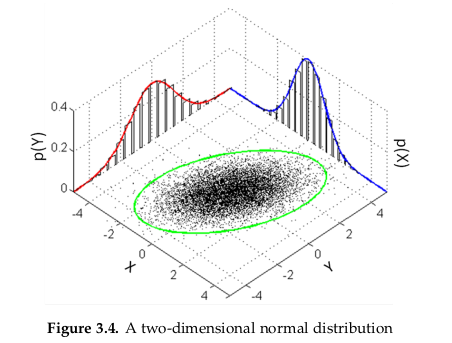
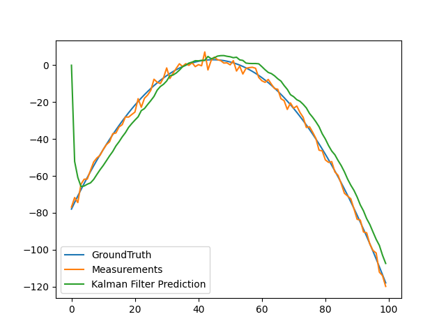
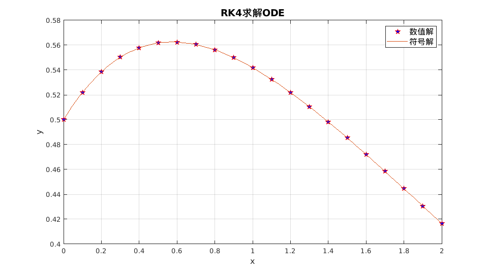
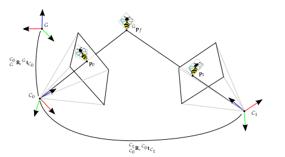
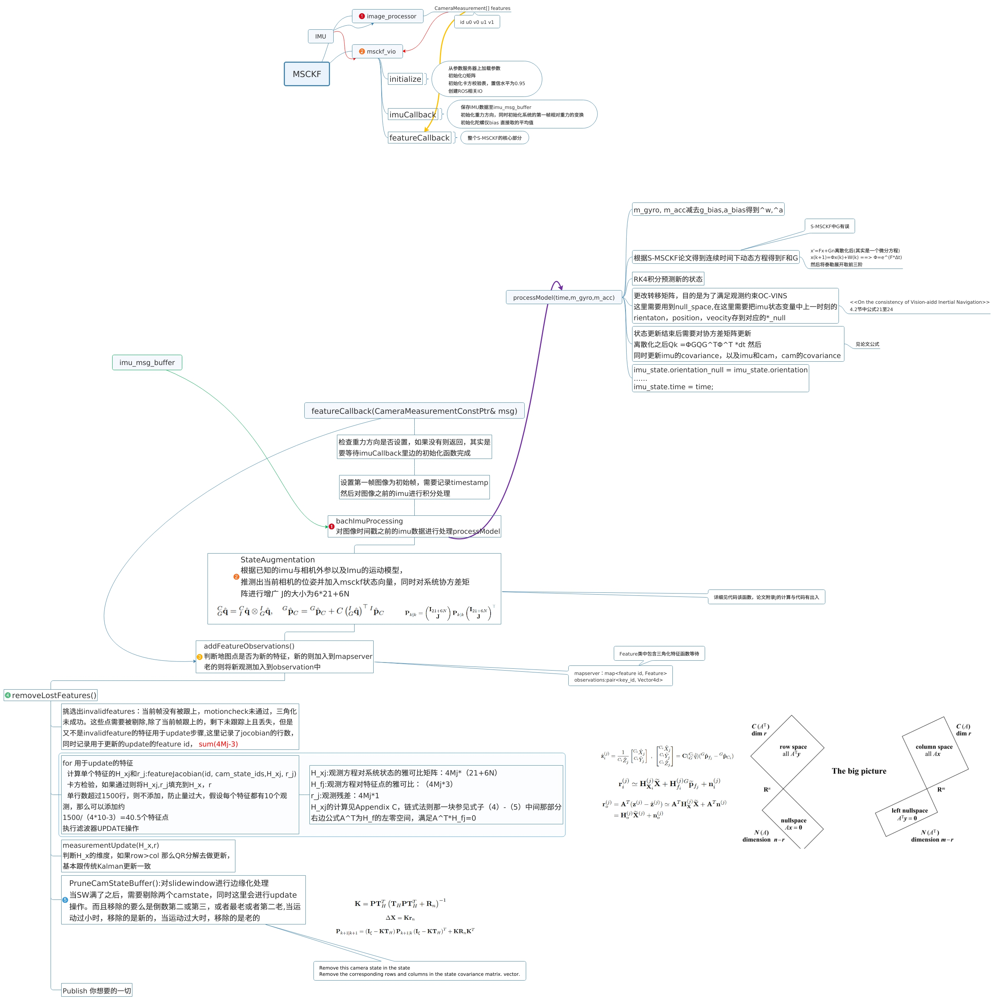
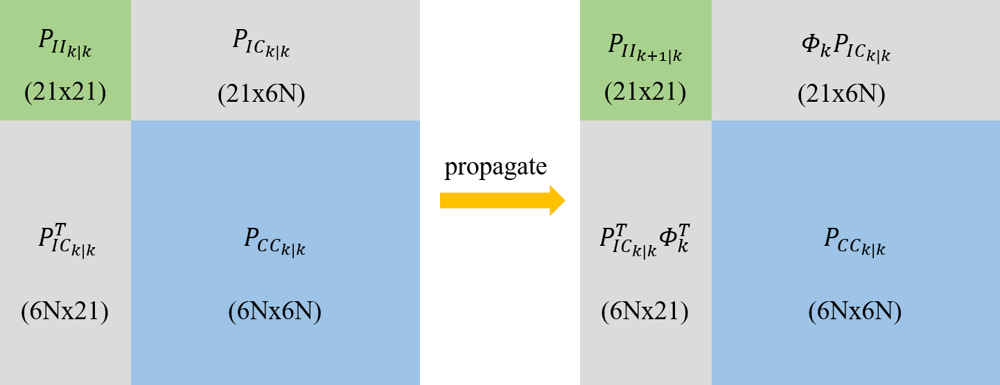
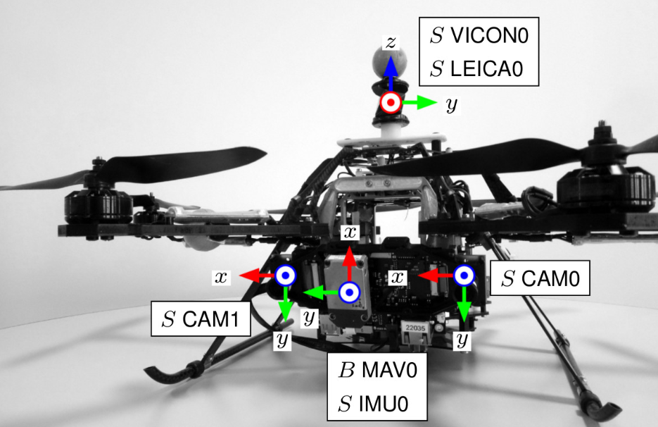
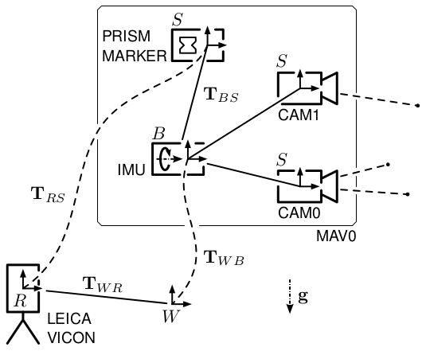

<center> <font color='green' size='15'> MSCKF-VIO Tutorial</font> </center>

# 1 符号表示

|          基本符号           |              例子               |
| :-------------------------: | :-----------------------------: |
|            标量             |               $x$               |
|            向量             |          $\mathbf{x}$           |
|            矩阵             |          $\mathbf{A}$           |
|      连续时间一阶导数       | $\dot{\mathbf{v}} = \mathbf{a}$ |
|      尖冒号表示估计值       |       $\hat{\mathbf{x}}$        |
|         单位四元数          |       $\bar{\mathbf{q}}$        |
|           坐标系            |            B 或者{B}            |
|   坐标系内点用左上方表示    |       $^{G} {\mathbf{p}}$       |
| 坐标系A$\rightarrow$坐标系B |      $_{A}^{B} \mathbf{R}$      |


|        误差符号        |                             例子                             |
| :--------------------: | :----------------------------------------------------------: |
| $\Delta$：两个向量误差 |     $\Delta \mathbf{p} = \mathbf{p} - \hat{\mathbf{p}}$      |
|  $\delta$：四元数误差  |       $\delta \mathbf{\theta} \quad \delta \mathbf{q}$       |
|  波浪号表示一般性误差  | $\tilde{\mathbf{x}} =\mathbf{x} -  \hat{\mathbf{x}} \quad with \quad \mathbf{x} = (\mathbf{p}, \mathbf{\theta})^{T}$ |


* G : 世界坐标系
* C : 相机坐标系
* B : 机体坐标系

# 2 概率状态估计

## 2.1 概率论基础


$P(x = X)$ 在某个范围内的概率等于 概率密度函数$p(x)$ 在该范围内的积分
$$
Pr(a \le x \le b) = \int_{a}^{b} p(x) dx \tag{1}
$$


均值和方差

* $\mathbb{E}(x) = \int x p(x) dx$   
* $Var(x) = \mathbb{E}[x - \mathbb{E}(x)^2] = \sigma^2$

## 2.2 高斯分布

一维高斯密度函数
$$
p(x; \mu, \sigma) = \frac{1}{\sqrt{2 \pi \sigma^2}} exp
\left\{ 
	-\frac{(x- \mu)^2}{2\sigma^2}
\right\} \tag{2}
$$


$N$维高斯密度函数
$$
p(\mathbf{x}; \mathbf{\mu}, \mathbf{\Sigma}) =
\frac{1}{\sqrt{(2\pi)^2|\mathbf{\Sigma}|}} exp
\left\{ 
	-\frac{1}{2} (\mathbf{x}- \mathbf{\mu})^T\Sigma^{-1}(\mathbf{x}- \mathbf{\mu})
\right\} \tag{3}
$$
其中：
$$
\begin{aligned}
	Cov(\mathbf{x}, \mathbf{y}) &= \mathbb{E[(\mathbf{x} - \mathbb{E(x)})(\mathbf{y} - \mathbb{E(y)})]}
\\

Cov\left(\begin{bmatrix}
	x_1 \\
	x_2 \\
	\vdots \\
	x_n
\end{bmatrix}
\right) &=
\begin{bmatrix}
	\sigma_{x_1}^2 & \rho_{(x_1, x_2)}\sigma_{x_1}\sigma_{x_2} & \dots & \rho_{(x_1, x_n)}\sigma_{x_1}\sigma_{x_n}  \\
	\rho_{(x_2, x_1)}\sigma_{x_2}\sigma_{x_1} & \sigma_{x_2}^2 & \dots & \rho_{(x_2, x_n)}\sigma_{x_2}\sigma_{x_n}  \\
	\vdots & \vdots & \ddots & \vdots  \\
	\rho_{(x_n, x_1)}\sigma_{x_n}\sigma_{x_1} &  \rho_{(x_n, x_2)}\sigma_{x_n}\sigma_{x_2} & \dots  & \sigma_{x_n}^2
\end{bmatrix}
\end{aligned} \tag{4}
$$




## 2.3 条件高斯

$$
\begin{bmatrix}
	\mathbf{x} \\
	\mathbf{y} 
\end{bmatrix} =
N(\mathbf{\mu}, \mathbf{\Sigma}) =
\left(
    \begin{bmatrix}
        \mu_x \\
        \mu_y 
    \end{bmatrix},
    \begin{bmatrix}
        \Sigma_{xx} & \Sigma_{xy} \\
        \Sigma_{yx} & \Sigma_{yy} 
    \end{bmatrix}
\right) \tag{5}
$$

边缘化
$$
p(x) = \int p(x,y) dy
	 = \int p(x|y) p(y)dy = N(\mu_x, \Sigma_{xx})
$$
条件概率
$$
p\left(
    \begin{bmatrix}
        x \\
        y 
    \end{bmatrix}
\right) 
=
N\left(
    \begin{bmatrix}
        \mu_x \\
        \mu_y 
    \end{bmatrix},
    \begin{bmatrix}
        \Sigma_{xx} & \Sigma_{xy} \\
        \Sigma_{yx} & \Sigma_{yy} 
    \end{bmatrix}
\right)
=
N\left(
    \begin{bmatrix}
        \mu_x \\
        A\mu_x + b 
    \end{bmatrix},
    \begin{bmatrix}
        \Sigma_{xx} & \Sigma_{xx}A^T \\
        A\Sigma_{xx} & A\Sigma_{xx}A^T + Q 
    \end{bmatrix}
\right) \tag{6}
$$
其中：

* $ \mathbf{x} \sim N(\mu_x, \Sigma_{xx})$
* $y = Ax + b, \quad b \sim N(0, Q)$

# 3 卡尔曼滤波

## 3.1 卡尔曼滤波

初始状态估计
$$
\mathbf{x_0} \sim N(\hat{\mathbf{x}}_{0|0}, \mathbf{\Sigma}_{0|0})
$$
预测
$$
\mathbf{Given}: \mathbf{x}_{t+1} = \mathbf{A}_{t}\mathbf{x}_{t} + \mathbf{B}_{t}\mathbf{u}_{t} + \mathbf{\epsilon}_{t} \quad \mathbf{\epsilon}_{t} \sim N(\mathbf{0}, \mathbf{Q}_t)
\\
\begin{aligned}
	\hat{\mathbf{x}}_{t+1|t} &= \mathbf{A}_{t|t}\hat{\mathbf{x}}_{t} + \mathbf{B}_{t}\mathbf{u}_{t} \\
	\hat{\mathbf{\Sigma}}_{t+1|t} &= \mathbf{A}_{t}\hat{\mathbf{\Sigma}}_{t}\mathbf{A}_{t}^T + \mathbf{Q}_{t}

\end{aligned}
$$
更新
$$
\mathbf{Given}: \mathbf{x}_{t} = \mathbf{C}_{t}\mathbf{x}_{t} + 	\mathbf{\epsilon}_{t} \quad \mathbf{\delta}_{t} \sim N(\mathbf{0}, \mathbf{R}_t)
\\
\begin{aligned}
	\hat{\mathbf{x}}_{t|t} &= \hat{\mathbf{x}}_{t|t-1} + \mathbf{K}_{t}(\mathbf{z}_t - C_t\hat{\mathbf{x}}_{t|t-1}) \\
	\mathbf{\Sigma}_{t|t} &= \mathbf{\Sigma}_{t|t-1} - K_t C_t \mathbf{\Sigma}_{t|t-1} \\
	\mathbf{K}_{t} &= \mathbf{\Sigma}_{t|t-1}C_t^T(C_t\mathbf{\Sigma}_{t|t-1}C_t^T + R_t)^{-1}

\end{aligned}
$$

## 3.2 扩展卡尔曼滤波EKF

系统动态模型
$$
\begin{aligned}
	\mathbf{x}_{t+1} &= f(\mathbf{x}_t, \mathbf{u}_t, \mathbf{w}_t) \quad \mathbf{w}_t \sim N(\mathbf{0}, Q_t) \\
	\mathbf{z}_t &= h(\mathbf{x}_t, \mathbf{v}_t) \quad \quad  \mathbf{v}_t \sim N(\mathbf{0}, R_t)

\end{aligned}
$$
泰勒公式
$$
f(x) = \frac{f(x_0)}{0!} + \frac{f^{\prime}(x_0)}{1!}(x- x_0) + \frac{f^{\prime{\prime}}(x_0)}{2!}(x- x_0)^2 + \cdots + \frac{f^{(n)}(x_0)}{n!}(x- x_0)^n + R_n(x)
$$


## 3.3 Python例子

**二次函数添加噪点**

```python
import numpy as np

class KalmanFilter(object):
    def __init__(self, F = None, B = None, H = None, Q = None, R = None, P = None, x0 = None):

        if(F is None or H is None):
            raise ValueError("Set proper system dynamics.")

        self.n = F.shape[1]
        self.m = H.shape[1]

        self.F = F
        self.H = H
        self.B = 0 if B is None else B
        self.Q = np.eye(self.n) if Q is None else Q
        self.R = np.eye(self.n) if R is None else R
        self.P = np.eye(self.n) if P is None else P
        self.x = np.zeros((self.n, 1)) if x0 is None else x0

    def predict(self, u = 0):
        self.x = np.dot(self.F, self.x) + np.dot(self.B, u)
        self.P = np.dot(np.dot(self.F, self.P), self.F.T) + self.Q
        return self.x

    def update(self, z):
        y = z - np.dot(self.H, self.x)
        S = self.R + np.dot(self.H, np.dot(self.P, self.H.T))
        K = np.dot(np.dot(self.P, self.H.T), np.linalg.inv(S))
        self.x = self.x + np.dot(K, y)
        I = np.eye(self.n)
        self.P = np.dot(np.dot(I - np.dot(K, self.H), self.P), 
        	(I - np.dot(K, self.H)).T) + np.dot(np.dot(K, self.R), K.T)

def example():
	dt = 1.0/60
	F = np.array([[1, dt, 0], [0, 1, dt], [0, 0, 1]])
	H = np.array([1, 0, 0]).reshape(1, 3)
	Q = np.array([[0.05, 0.05, 0.0], [0.05, 0.05, 0.0], [0.0, 0.0, 0.0]])
	R = np.array([0.5]).reshape(1, 1)

	x = np.linspace(-10, 10, 100)
	ground_truths = -x**2 - 2*x + 2
	measurements = -(x**2 + 2*x - 2) + np.random.normal(0, 2, 100)

	kf = KalmanFilter(F = F, H = H, Q = Q, R = R)
	predictions = []

	for z in measurements:
		predictions.append(np.dot(H,  kf.predict())[0])
		kf.update(z)

	import matplotlib.pyplot as plt
	plt.plot(range(len(ground_truths)), ground_truths, label = 'GroundTruth')
	plt.plot(range(len(measurements)), measurements, label = 'Measurements')
	plt.plot(range(len(predictions)), np.array(predictions), label = 'Kalman Filter Prediction')
	plt.legend()
	plt.show()

if __name__ == '__main__':
    example()
```

**kalman filter结果**




# 4 IMU

## 4.1 Accelerometers(加速计)

$$
^B \mathbf{a}_m = \mathbf{T}_a {_G^B}\mathbf{R}(^G\mathbf{a} - ^G\mathbf{g}) + \mathbf{n}_a + \mathbf{b}_a
$$

其中：

* $\mathbf{T}_a$: 加速度计测量中导致未对准和比例误差的矩阵系数
* $^G\mathbf{a}$: 全局坐标系中 IMU 的真实加速度，{ B } 表示惯性体（IMU）坐标系。
* $^G\mathbf{g}: \quad \mathbf{g} = (0, 0, -1)^T$  

* $\mathbf{n}_a \sim N(0, N_a)$
* $\mathbf{b}_a：$ 随时间变化，建模为随机游走过程噪声$n_{wa} \sim N(0,N_{wa} )$

## 4.2 Gyroscope(陀螺仪)


$$
^B \mathbf{\omega}_m = \mathbf{T}_g \omega +\mathbf{T}_s ^B\mathbf{a} + \mathbf{n}_g + \mathbf{b}_g
$$
其中：

* $\mathbf{n}_g \sim N(0, N_g)$

* $\mathbf{b}_g：$ 随时间变化，建模为随机游走过程噪声$n_{wg} \sim N(0,N_{wg} )$

## 4.3 Noise and Bias Characteristics(噪声和零偏特性)

$$
\sigma_{a_c} = \sigma_{a_d} \sqrt{\Delta t}
$$

同样，随机游走偏差标准差也必须转换为连续值。
$$
\sigma_{wa_c} = \frac{\sigma_{wa_d}}{\sqrt{\Delta t}}
$$

## 4.4 运动模型

**状态向量：**
$$
\mathbf{X} = \begin{bmatrix}
    _G^I\mathbf{q}(t)^T, 
    \mathbf{b}_g(t)^T, 
    ^G\mathbf{v}_I(t)^T, 
    \mathbf{b}_a(t)^T,
    ^G\mathbf{p}_I(t)^T, 
    _C^I\mathbf{q}(t)^T, 
    ^I{\mathbf{p}(t)_C}^T
\end{bmatrix}
$$

* $_G^I\mathbf{q}(t)^T$: 代表惯性系到IMU坐标系的旋转
* $\mathbf{b}_g(t)^T$: 表示在IMU坐标系中测量值线加速度的biases
*  $^G\mathbf{v}_I(t)^T$: 代表IMU坐标系在惯性系中的速度
* $\mathbf{b}_a(t)^T$: 表示在IMU坐标系中测量值角速度的biases
* $^G\mathbf{p}_I(t)^T$: 代表IMU坐标系在惯性系中的位置
* $C^I\mathbf{q}(t)^T$: 表示相机坐标系和IMU坐标系的相对位置，其中相机坐标系取左相机坐标系。
* $^I{\mathbf{p}(t)_C}^T$: 表示相机坐标系和IMU坐标系的相对位置，其中相机坐标系取左相机坐标系。
* $\mathbf{w}(t)^T = [w_x(t), w_y(t), w_z(t)]^T$ 是IMU角速度在IMU系中的坐标


$$
\begin{aligned}
	_G^I\dot{\mathbf{q}}(t) &= \frac{1}{2} \Omega(w(t))^{T} \mathbf{q}(t) \\
	\dot{\mathbf{b}}_{g}(t) &= \mathbf{n}_{wg}(t) \\
	^G\dot{\mathbf{v}}_I(t) &= ^G\mathbf{a}_I(t)   \\
	\dot{\mathbf{b}}_{a}(t) &= \mathbf{n}_{wa}(t) \\
	^G\dot{\mathbf{p}}_I(t) &= ^G\mathbf{v}_I(t)   \\
	_C^I\dot{\mathbf{q}}(t) &= \mathbf{0}_{4 \times 1}  \\
	 I\dot{\mathbf{p}}(t)_C &= \mathbf{0}_{3 \times 1} 
\end{aligned}
$$
**IMU的观测值为：**
$$
\begin{aligned}
	\mathbf{\omega}_m &=  \mathbf{\omega} + C(_G^I\mathbf{q}) \mathbf{\omega}_G + \mathbf{b}_g +  \mathbf{n}_g  \\
	\mathbf{a}_m &= C(_G^I\mathbf{q}) (^G\mathbf{a}_I - ^G\mathbf{g} + 2 \mathbf{{\omega}_G}_{\times} ^G\mathbf{v}_I + {{\omega}_G}_{\times}^2(^G\mathbf{p}_I)) + \mathbf{b}_a +  \mathbf{n}_a 
\end{aligned}
$$

* 将地球自转的影响忽略不计
* 其中$w_{G}$为地球的自转速度在G系的坐标

$$
\tilde{\mathbf{X}}_{IMU} = \mathbf{F} \tilde{{X}}_{IMU} + \mathbf{G} \mathbf{n}_{IMU}
$$

  矩阵形式
$$
\begin{aligned}
\underbrace{
	\begin{bmatrix}
		\dot{\delta{\theta}}_{I} \\
		\dot{\tilde{b}}_{g}  \\
		^{G}\dot{\tilde{v}}_{I} \\
		\dot{\tilde{b}}_{a}  \\
		^{G}\dot{\tilde{p}}_{I}
        \end{bmatrix}
}_{\dot{\tilde{\mathbf{X}}}_{IMU}} = 
\underbrace {
	\begin{bmatrix}
		-\mathbf{[w]}_{\times} & -\mathbf{I}_{3} & \mathbf{0}_{3 \times 3} 
        & \mathbf{0}_{3 \times 3}  & \mathbf{0}_{3 \times 3} \\
        \mathbf{0}_{3 \times 3} &  \mathbf{0}_{3 \times 3}  & \mathbf{0}_{3 \times 3}  & \mathbf{0}_{3 \times 3}  & \mathbf{0}_{3 \times 3}  \\
        -C (^I_G\hat{\mathbf{q}})^{T}\mathbf{[\hat{a}_{\times}]} & \mathbf{0}_{3 \times 3} & \mathbf{0}_{3 \times 3} & -C (^I_G\hat{\mathbf{q}})^{T} & \mathbf{0}_{3 \times 3} \\
         \mathbf{0}_{3 \times 3} &  \mathbf{0}_{3 \times 3}  & \mathbf{0}_{3 \times 3}  & \mathbf{0}_{3 \times 3}  & \mathbf{0}_{3 \times 3}  \\
         \mathbf{0}_{3 \times 3} &  \mathbf{0}_{3 \times 3}  & \mathbf{I}_{3}  & \mathbf{0}_{3 \times 3}  & \mathbf{0}_{3 \times 3} 
    \end{bmatrix}
}_{F}
\underbrace{
	\begin{bmatrix}
		\delta{\theta}_{I} \\
		\tilde{b}_{g}  \\
		^{G}\tilde{v}_{I} \\
		\tilde{b}_{a}  \\
		^{G}\tilde{p}_{I}
        \end{bmatrix}
}_{\tilde{\mathbf{X}}_{IMU}} \\ 
+ 
\underbrace{
	\begin{bmatrix}
		-\mathbf{I}_{3} & \mathbf{0}_{3 \times 3} & \mathbf{0}_{3 \times 3} & \mathbf{0}_{3 \times 3} \\
		\mathbf{0}_{3 \times 3} & \mathbf{I}_{3 } & \mathbf{0}_{3 \times 3} & \mathbf{0}_{3 \times 3} \\
		\mathbf{0}_{3 \times 3} & \mathbf{0}_{3 \times 3} &  -C (^I_G\hat{\mathbf{q}})^{T} &  \mathbf{0}_{3 \times 3}  \\
		\mathbf{0}_{3 \times 3} & \mathbf{0}_{3 \times 3} & \mathbf{0}_{3 \times 3}  & \mathbf{I}_{3 } \\
		\mathbf{0}_{3 \times 3} & \mathbf{0}_{3 \times 3} & \mathbf{0}_{3 \times 3} & \mathbf{0}_{3 \times 3}
        \end{bmatrix}
}_{G}
\underbrace{
	\begin{bmatrix}
		\mathbf{n}_g \\
		\mathbf{n}_{wg} \\
		\mathbf{n}_a \\
		\mathbf{n}_{wa} 
	\end{bmatrix}
}_{\mathbf{n}_{IMU}}

\end{aligned}
$$

**推到过程如下**

误差状态运动模型
$$
\mathbf{X} = \begin{bmatrix}
    _G^I\mathbf{\tilde{\theta}}(t)^T, 
    \mathbf{\tilde{b}}_g(t)^T, 
    ^G\mathbf{v}_I(t)^T, 
    \mathbf{b}_a(t)^T,
    ^G\mathbf{p}_I(t)^T, 
    _C^I\mathbf{q}(t)^T, 
    ^I{\mathbf{p}(t)_C}^T
\end{bmatrix}
$$

:bow:**推导$\delta \theta$**

对$_G^Iq = \delta \theta \otimes _I^G \hat{q}$左右两边同时求导得到：
$$
\begin{aligned}
	_G^I \dot{q} &= \dot{(\delta \theta \otimes _I^G \hat{q})} \\
	_G^I \dot{q} &= \dot{\delta \theta} \otimes _I^G \hat{q} + \delta q \otimes {}_G^I \dot{\hat{q}}  \\
				 \frac{1}{2} 
				 \begin{bmatrix} 
				 	w \\
				 	0
				 \end{bmatrix} \otimes {}_G^I q
                 &= \dot{\delta \theta} \otimes {}_G^I \hat{q} + \delta q \otimes 
                  \frac{1}{2} 
				 \begin{bmatrix} 
				 	w \\
				 	0
				 \end{bmatrix} \otimes {}_G^I \hat{q} 
\end{aligned}
$$
两边同时乘以${}_G^I \hat{q}^{-1} $ 得到:
$$
\begin{aligned}
	 \frac{1}{2} 
         \begin{bmatrix} 
         w \\
         0
         \end{bmatrix} \otimes  \delta q
         &= \dot{\delta q} + \frac{1}{2} \delta q \otimes 			            \begin{bmatrix} 
             \hat{w} \\
             0
         \end{bmatrix} \\
  \longrightarrow  
  \begin{bmatrix} 
      2 \dot{\delta \theta} \\
      0
  \end{bmatrix} 
  &=
  \begin{bmatrix} 
      w \\
      0
  \end{bmatrix} 
  \otimes \delta q - \delta q \otimes 
  \begin{bmatrix} 
      \hat{w} \\
      0
  \end{bmatrix} 
\end{aligned}
$$
 由$w_m = w + b_g + n_g$ 和 $\hat{w} = w_m - \hat{b}_g$可以求出$w$：
$$
w = \hat{w} + \hat{b}_g - b_g - n_g = \hat{w} - \tilde{b}_g - n_g
$$
带入$w$可得：
$$
\begin{aligned} 
    \begin{bmatrix} 
          \dot{\delta \theta} \\
          0
      \end{bmatrix} 
      &=
      \begin{bmatrix} 
          \hat{w} - \tilde{b}_g - n_g \\
          0
      \end{bmatrix} 
      \otimes \delta q - \delta q \otimes 
      \begin{bmatrix} 
          \hat{w} \\
          0
      \end{bmatrix} \\
      \begin{bmatrix} 
          \dot{\delta \theta} \\
          0
      \end{bmatrix} 
      &=
      \begin{bmatrix} 
          \hat{w} \\
          0
      \end{bmatrix} 
      \otimes \delta q - \delta q  
      \begin{bmatrix} 
          \hat{w} \\
          0
      \end{bmatrix} -
       \begin{bmatrix} 
         \tilde{b}_g + n_g \\
          0
      \end{bmatrix}  \otimes \delta q \\
     \begin{bmatrix} 
          \dot{\delta \theta} \\
          0
      \end{bmatrix} 
      &=
      \begin{bmatrix} 
          - \left \lfloor \hat{w}_{\times} \right \rfloor & \hat{w} \\
          -\hat{w}^T & 0
      \end{bmatrix} \delta q - 
      \begin{bmatrix} 
          \left \lfloor \hat{w}_{\times} \right \rfloor & \hat{w} \\
          -\hat{w}^T & 0
      \end{bmatrix} \delta q -
      \begin{bmatrix} 
          - \left \lfloor (\tilde{b}_g + n_g )_{\times} \right \rfloor & \tilde{b}_g + n_g  \\
          -(\tilde{b}_g + n_g )^T & 0
      \end{bmatrix}
      \begin{bmatrix} 
          \frac{1}{2} \delta \theta\\
          1
      \end{bmatrix} 
\end{aligned}
$$
忽略掉极小量相乘的项得：
$$
\begin{bmatrix} 
    \dot{\delta \theta} \\
    0
\end{bmatrix} =
\begin{bmatrix} 
    -2\left \lfloor \hat{w}_{\times} \right \rfloor & 0 \\
    0 & 0
\end{bmatrix}
\begin{bmatrix} 
    \frac{1}{2} \delta \theta\\
    1
\end{bmatrix} -
\begin{bmatrix} 
   \tilde{b}_g + n_g  \\
   0
\end{bmatrix}
$$
因此$\delta \theta$:
$$
\dot{\delta \theta} = -\left \lfloor \hat{w}_{\times} \right \rfloor \delta \theta - \tilde{b}_g - n_g
$$
:rose: 推导$\dot {\tilde{b}}_g$

$$
\dot {\tilde{b}}_g = \dot {b}_g - \dot {\hat{b}}_g = n_{wg}
$$
:two_hearts: 推导$\dot {\tilde{b}}_a$
$$
\dot {\tilde{b}}_a = \dot {b}_a - \dot {\hat{b}}_a = n_{wa}
$$
:nail_care:推导${}^G\dot {\tilde{p}}_I$
$$
\begin{aligned}
    {}^G\dot {\tilde{p}}_I 
    	& = {}^G\dot {p}_I - {}^G\dot {\hat{p}}_I \\
    	& = {}^G v_I - {}^G \hat{v}_I \\
    	&= {}^G \tilde{v}_I

\end{aligned}
$$
:fire: 推导${}^G\dot {\tilde{v}}_I$
$$
\begin{aligned}
	\hat{a} &=  a_m - \tilde{b}_a \\
	
    {}^G\dot {v}_I & = {}^G a_I = C({}_G^Iq)^T(a_m - b_a- n_a) + {}^Gg \\
 	{}^G\dot {\hat{v}}_I &=  C({}_G^I \hat{q})^T \hat{a} + {}^Gg \\
 	{}^G\dot {\tilde{v}}_I & = {}^G\dot {v}_I - {}^G\dot {\hat{v}}_I \\
 	&= C({}_G^Iq)^T(a_m - b_a- n_a) + {}^Gg - C({}_G^I \hat{q})^T \hat{a} - {}^Gg \\
 	&= C({}_G^I\hat{q})^T (I + \left \lfloor \delta \theta_{\times} \right \rfloor) (a_m - b_a- n_a) - C({}_G^I\hat{q})^T \hat{a} \\
 	&= C({}_G^I\hat{q})^T (I + \left \lfloor \delta \theta_{\times} \right \rfloor) (\hat{a} - \tilde{b}_a - n_a) - C({}_G^I\hat{q})^T \hat{a} 
\end{aligned}
$$
省略掉高次项$\left \lfloor \delta \theta_{\times} \right \rfloor) (- \tilde{b}_a - n_a)$
$$
\begin{aligned}
    {}^G\dot {\tilde{v}}_I & = C({}_G^I\hat{q})^T (\left \lfloor \delta \theta_{\times} \right \rfloor) \hat{a} - \tilde{b}_a - n_a) \\
    &= - C({}_G^I\hat{q})^T \left \lfloor \hat{a}_{\times} \right \rfloor \delta \theta -  C({}_G^I\hat{q})^T \tilde{b}_a - C({}_G^I\hat{q})^T n_a
\end{aligned}
$$

## 4.5 状态转移矩阵

$$
\dot{\mathbf{\Phi}}(t_k + \tau, t_k) = \mathbf{F}\mathbf{\Phi}(t_k + \tau, t_k)
$$

性质：

* $ \mathbf{\Phi}(t_k, t_k) = \mathbf{I}_{15 \times 15}$
* $\mathbf{\Phi} \approx I + F \Delta {t}$

因此:
$$
\tilde{\mathbf{X}}_{k+1} = \mathbf{\Phi}(t_k + T, t_k) \tilde{\mathbf{X}}_{k}
$$

**四阶Runge-Kutta积分**

ODE方程：
$$
y\prime = f(x, y), y(x_0) = y_0, x_0 \le x \le x_n
$$
so that:
$$
\begin{aligned}
    y_{i+1} &= y_i + \frac{1}{6} h (k_1 + 2k_2 + 2k_3 + k_4) \\
    k_1 &= f(x_i, y_i) \\
    k_2 &= f(x_i + \frac{1}{2}h, y_i + \frac{1}{2} k_1 h) \\
    k_3 &= f(x_i + \frac{1}{2}h, y_i + \frac{1}{2} k_2 h) \\
    k_4 &= f(x_i + h, y_i + k_3 h) 
\end{aligned}
$$
例
$$
2 y\prime + y = e^{-x}, y(0) = \frac{1}{2}, 0 \le x \le 2
$$

```matlab
% 输入参数
fun = @(x, y) (exp(-x) - y) / 2;
x = 0 : 0.1 : 2;
y0 = 1/2;
% 调用RK4函数求解
y = RK4(fun, x, y0);
% 设置图幅
fig = gcf;
fig.Color = 'w';
fig.Position = [250, 250, 960, 540];
% 绘制数值解
p = plot(x, y);
p.LineStyle = 'none';
p.Marker = 'p';
p.MarkerEdgeColor = 'r';
p.MarkerFaceColor = 'b';
p.MarkerSize = 8;
hold on, grid on
% 求解符号解
syms y(x)
equ = 2 * diff(y, x) == exp(-x) - y;
cond = y(0) == 1/2;
y = dsolve(equ, cond);
% 绘制符号解
fplot(y, [0, 2])
% 设置信息
xlabel('x', 'fontsize', 12);
ylabel('y', 'fontsize', 12);
title('RK4求解ODE', 'fontsize', 14);
legend({'数值解', '符号解'}, 'fontsize', 12);
```

RK4

```matlab
function y = RK4(fun, x, y0)

    %RK4 使用经典的RK4方法求解一阶常微分方程。
    % fun是匿名函数。
    % x是迭代区间
    % y0迭代初始值。

    y = 0 * x;
    y(1) = y0;
    h = x(2) - x(1);
    n = length(x);

    for m = 1 : n-1
        k1 = fun(x(m), y(m));
        k2 = fun(x(m)+h/2, y(m)+h*k1/2);
        k3 = fun(x(m)+h/2, y(m)+h*k2/2);
        k4 = fun(x(m)+h, y(m)+h*k3);
        y(m+1) = y(m) + h*(k1 + 2*k2 + 2*k3 + k4) / 6;
    end
end
```


求解如下：



# 5 Computer Vision

## 5.1 Pinhole Camera Model(针孔模型)


$$
\begin{aligned}
	x = f_x \frac{X}{Z}  \\
	y = f_y \frac{Y}{Z}
\end{aligned}
$$
**相机投影**


$$
\begin{aligned}
	x = f_x \frac{X}{Z} + c_x \\
	y = f_y \frac{Y}{Z} + c_y
\end{aligned}
$$


$$
\mathbf{h}
\begin{pmatrix}
	X \\
	Y \\
	Z
\end{pmatrix} =
\begin{bmatrix}
	f_x &   0 \\
	0   & f_y 
\end{bmatrix}
\begin{bmatrix}
	\frac{X}{Z} \\
	\frac{Y}{Z}
\end{bmatrix} +
\begin{bmatrix}
	c_x \\
	c_y 
\end{bmatrix}
$$
**图像畸变失真**
$$
\begin{aligned}
	\mathbf{h}
    \begin{pmatrix}
        X \\
        Y \\
        Z
    \end{pmatrix} &=
    \begin{bmatrix}
        f_x &   0 \\
        0   & f_y 
    \end{bmatrix}
    \begin{pmatrix}
    	d_r
    	\begin{bmatrix}
    		u \\
    		v
    	\end{bmatrix}
    	+ d_t
    \end{pmatrix} +
    \begin{bmatrix}
        c_x \\
        c_y 
    \end{bmatrix}
    \\
    d_r &= (1 + k_1r + k_2r^2 + k_3r^3) \\
    d_t &= 
    \begin{bmatrix}
        2uvt_1 + (r+2u^2)t_2 \\
        2uvt_2 + (r+2v^2)t_1 
    \end{bmatrix}
    \\
    with \quad u &= \frac{X}{Z}, v = \frac{Y}{Z}, r = u^2 + v^2
\end{aligned}
$$
**Frame Transformation**
$$
\begin{bmatrix}
    u \\
    v
\end{bmatrix}
=
\mathbf{h}(_G^C\mathbf{R}(^G\mathbf{x} - ^G\mathbf{p}_C))
$$
**Triangulation（三角化）**



$C_0$帧是第一次观察到该点的相机帧，该点在第$i$个相机$C_i$帧中的位置如下。
$$
\begin{aligned}
	^{C_i}\mathbf{p}_f &= _{C_0}^{C_i}\mathbf{R}(^{C_0}\mathbf{p}_f - ^{C_0}\mathbf{p}_{C_{i}}) \\
	^{C_i}\mathbf{p}_f &= _{C_0}^{C_i}\mathbf{R} ^{C_0}\mathbf{p}_f + ^{C_i}\mathbf{p}_{C_{0}}
\end{aligned}
$$
这可以用逆深度参数化重写，以提高数值稳定性并帮助避免局部最小值
$$
\begin{aligned}
	^{C_i}\mathbf{p}_f &= _{C_0}^{C_i}\mathbf{R} ^{C_0}\mathbf{p}_f + ^{C_i}\mathbf{p}_{C_{0}} \\
	& = _{C_0}^{C_i}\mathbf{R} ^{C_0}
	\begin{bmatrix} 
		c_n X \\
		c_n Y \\
		c_n Z
	\end{bmatrix}
	+ ^{C_i}\mathbf{p}_{C_{0}} \\
	&= ^{C_0} Z
	\begin{pmatrix} 
		_{C_0}^{C_i}\mathbf{R} 
		\begin{bmatrix}
			\frac{^{C_0}X}{^{C_0}Z} \\
			\frac{^{C_0}Y}{^{C_0}Z} \\
			1
		\end{bmatrix} +
		\frac{1}{^{C_0}Z} ^{C_i} \mathbf{p}_{C_{0}}
	\end{pmatrix} \\
	&= ^{C_0} Z
	\begin{pmatrix} 
		_{C_0}^{C_i}\mathbf{R}
		\begin{bmatrix}
			\alpha \\
			\beta \\
			1
		\end{bmatrix} +
		\rho ^{C_i}\mathbf{p}_{C_{0}}
	\end{pmatrix} \\
	&= ^{C_0} Z \mathbf{g}_i
	\begin{pmatrix} 
		\alpha \\
		\beta \\
		\rho 
	\end{pmatrix}
\end{aligned}
$$
其中：

* $\alpha = \frac{^{C_0}X}{^{C_0}Z}$
* $\beta = \frac{^{C_0}Y}{^{C_0}Z}$ 
* $ \rho = \frac{1}{^{C_0}Z}$

**Gauss-Newton Minimization**
$$
\mathbf{f}_i(\mathbf{\theta}) = \mathbf{Z}_i - \mathbf{h}(\mathbf{g}_i(\mathbf{\theta})) \quad with: \quad 
\mathbf{\theta} =
	\begin{pmatrix} 
		\alpha \\
		\beta \\
		\rho 
	\end{pmatrix}
$$

$$
S(\mathbf{\theta}) = \sum_{i=1}^{n} \mathbf{f}_i(\mathbf{\theta})^2
$$

Jacobian
$$
\mathbf{J}_{\mathbf{f}} = \frac{\partial{\mathbf{f}}}{\partial{\mathbf{\theta}}} = \frac{\partial{\mathbf{\mathbf{h}}}}{\partial{\mathbf{\mathbf{g}}}} 
\frac{\partial{\mathbf{\mathbf{g}}}}{\partial{\mathbf{\mathbf{\theta}}}}
$$
其中：
$$
\frac{\partial{\mathbf{\mathbf{h}}}}{\partial{\mathbf{\mathbf{g}}}} =
\begin{bmatrix}
    f_x & 0 \\
    0 & f_y 
\end{bmatrix}
\begin{bmatrix}
    \frac{d_r}{z} + \frac{\partial{d_r}}{\partial{x}}u  + \frac{\partial{d_t}}{\partial{x}} &   \frac{\partial{d_r}}{\partial{y}}u + \frac{\partial{d_t}}{\partial{y}} &  -\frac{d_r}{z}u +  \frac{\partial{d_r}}{\partial{z}}u  + \frac{\partial{d_t}}{\partial{z}} \\
    \frac{\partial{d_r}}{\partial{x}}v + \frac{\partial{d_t}}{\partial{y}} & \frac{d_r}{z} +  \frac{\partial{d_r}}{\partial{y}}v + \frac{\partial{d_t}}{\partial{y}} &   -\frac{d_r}{z}v +  \frac{\partial{d_r}}{\partial{z}}v  + \frac{\partial{d_t}}{\partial{z}} 
\end{bmatrix}
$$

$$
\begin{aligned}
    \mathbf{g}_i(\mathbf{\theta}) 
        &= _{C_0}^{C_i}  \mathbf{R}
        \begin{bmatrix} 
            \alpha \\
            \beta \\
            \rho 
        \end{bmatrix} + \rho ^{C_i}\mathbf{p}_{C_{0}}
     \\
     \frac{\partial{\mathbf{g}_i}}{\mathbf{\partial{\theta}}} &= 
     \begin{bmatrix} 
     	 \frac{\partial{\mathbf{g}_i}}{\mathbf{\alpha}} & 
     	 \frac{\partial{\mathbf{g}_i}}{\mathbf{\beta}} & 
     	 \frac{\partial{\mathbf{g}_i}}{\mathbf{\rho}}
     \end{bmatrix} 
     \\
     &=
     \begin{bmatrix} 
     	_{C_0}^{C_i}  \mathbf{R}
     	\begin{bmatrix}
     		1 \\
     		0 \\
     		0
     	\end{bmatrix} &
     	_{C_0}^{C_i}  \mathbf{R}
     	\begin{bmatrix}
     		0 \\
     		1 \\
     		0
     	\end{bmatrix} &
     	^{C_i}  \mathbf{p}_{C_{0}}
	 \end{bmatrix} 
\end{aligned}
$$
参数更新
$$
\mathbf{\theta}_i^{(s+1)} = \mathbf{\theta}_i^{(s)} -
\left(\mathbf{J}_{\mathbf{f}}^T \mathbf{J}_{\mathbf{f}} \right)^{-1}\mathbf{J}_{\mathbf{f}}^T
\mathbf{f}( \mathbf{\theta}_i^{(s)})
$$

**Feature Points**


**Feature Matching**


# 6 MSCKF

## 6.1 Overview


传统的EKF-SLAM框架中，特征点的信息会加入到特征向量和协方差矩阵里,这种方法的缺点是特征点的信息会给一个初始深度和初始协方差，如果不正确的话，极容易导致后面不收敛，出现inconsistent的情况。MSCKF维护一个pose的FIFO，按照时间顺序排列，可以称为滑动窗口，一个特征点在滑动窗口的几个位姿都被观察到的话，就会在这几个位姿间建立约束，从而进行KF的更新。如下图所示, 左边代表的是传统EKF SLAM, 红色五角星是old feature,这个也是保存在状态向量中的,另外状态向量中只保存最新的相机姿态; 中间这张可以表示的是keyframe-based SLAM, 它会保存稀疏的关键帧和它们之间相关联的地图点; 最右边这张则可以代表MSCKF的一个基本结构, MSCKF中老的地图点和滑窗之外的相机姿态是被丢弃的, 它只存了滑窗内部的相机姿态和它们共享的地图点.


**前端**


**跟踪流程**


### Initialization


**trackFeatures**


**twoPointRansac**

```c++
/**
 * @brief 计算原图像帧关键点对应的矫正位置
 * @param pts1：上一时刻的关键点位置
 * @param pts2:当前时刻跟踪匹配到的关键点位置
 * @param R_p_c:根据imu信息计算得到的两个时刻相机的相对旋转信息
 * @param distortion_model,intrinsics：相机内参和畸变模型
 * @param inlier_error：内点可接受的阈值（关键点距离差）
 * @param success_probability：成功的概率
 * @return inlier_markers：内点标志位
 */
void ImageProcessor::twoPointRansac(
    const vector<Point2f>& pts1, const vector<Point2f>& pts2,
    const cv::Matx33f& R_p_c, const cv::Vec4d& intrinsics,
    const std::string& distortion_model,
    const cv::Vec4d& distortion_coeffs,
    const double& inlier_error,
    const double& success_probability,
    vector<int>& inlier_markers)
```


对极几何可约束
$$
p_2^T [t]_{\times} R p_1  = 0
$$

* $p_1 = [x_1, y_1, 1]^T$
* $p_2 = [x_2, y_2, 1]^T$

$$
\begin{bmatrix}
	x_2 & y_2 & 1
\end{bmatrix}
\begin{bmatrix}
	0 & -t_z & t_y \\
	t_z & 0 & -t_x \\
	-t_y & t_x & 0
\end{bmatrix}
\begin{bmatrix}
	x_1 \\
    y_1 \\
    1
\end{bmatrix}
= 0
$$

展开之后我们可以得到
$$
\begin{bmatrix}
	y_1 - y_2 & -(x_1 - x_2) & x_1y_2 - x_2y_1
\end{bmatrix}
\begin{bmatrix}
	t_x \\
    t_y \\
    t_z
\end{bmatrix}
= 0
$$

```c++
vector<Point2d> pts_diff(pts1_undistorted.size());
  for (int i = 0; i < pts1_undistorted.size(); ++i)
    pts_diff[i] = pts1_undistorted[i] - pts2_undistorted[i];
...  
...
MatrixXd coeff_t(pts_diff.size(), 3);
  for (int i = 0; i < pts_diff.size(); ++i) {
    coeff_t(i, 0) = pts_diff[i].y;
    coeff_t(i, 1) = -pts_diff[i].x;
    coeff_t(i, 2) = pts1_undistorted[i].x*pts2_undistorted[i].y -
      pts1_undistorted[i].y*pts2_undistorted[i].x;
}
```

至于这个模型是怎么选出来的呢? 假设一共有N个inliers点对,那么根据式(2.4)势必会得到一个$N*3 * 3*1 = N(0)$的等式.但事实上由于误差和outliers的存在,最终结果不可能为零,我们取两个点将式子分块,并且只考虑两个点的情况,那么将会有:
$$
{\color{Green} \begin{bmatrix}
y_{1}-y_{2} & -(x_{1}-x_{2}) & x_{1}y_{2}-x_{2}y_{2}\\
y_{3}-y_{4} & -(x_{3}-x_{4}) & x_{3}y_{4}-x_{4}y_{3}
\end{bmatrix}}
\cdot 
\begin{bmatrix}
t_{x}\\ 
t_{y}\\ 
t_{z}
\end{bmatrix}=
{\color{Green} \begin{bmatrix}
A_{x} \\ A_{y} \\ A_{z}
\end{bmatrix}^{T}}
\cdot 
\begin{bmatrix}
t_{x}\\ 
t_{y}\\ 
t_{z}
\end{bmatrix}\approx
{\color{Red} 
\begin{bmatrix}
0\\ 
0
\end{bmatrix}}
$$
那我们可以分别得到以下三个式子:
$$
\begin{split}
\begin{bmatrix}
A_{x} \\ 
A_{y}
\end{bmatrix}^{T}
\cdot
\begin{bmatrix}
t_{x} \\ 
t_{y}
\end{bmatrix}
\approx {\color{Green}A_{z}}\cdot t_{z} \\
\begin{bmatrix}
A_{x} \\ 
A_{z}
\end{bmatrix}^{T}
\cdot
\begin{bmatrix}
t_{x} \\ 
t_{z}
\end{bmatrix}
\approx {\color{Green}A_{y}}\cdot t_{y} \\

\begin{bmatrix}
A_{y} \\ 
A_{z}
\end{bmatrix}^{T}
\cdot
\begin{bmatrix}
t_{y} \\ 
t_{z}
\end{bmatrix}
\approx {\color{Green}A_{x}}\cdot t_{x} 
\end{split}
$$
我们的目标当然是使得误差最小,所以作者的做法是比较式子绿色部分的大小,取最小的并令模型的平移为1,进而直接求逆然后得到最初的模型假设,之后要做的步骤跟常规RANSAC就十分接近了,找出适应当前模型的所有inliers,然后计算误差并不断迭代找到最好的模型.
	至此我们已经完成了整个feature的tracking过程!

**addNewFeatures & pruneGridFeatures**

如果一直tracking的话那么随着时间流逝,有些特征会消失,有些可能也会有累计误差,所以我们势必要添加一些新的特征,这个步骤正是在跟踪上一帧特征之后要做的,因为stereoMatching 和twoPointRansac都会剔除一些outliers,那我们需要提取新的特征保证能一直运行下去.


## 6.2 State Representation


**publish**

```msg
uint64 id
# Normalized feature coordinates (with identity intrinsic matrix)
float64 u0 # horizontal coordinate in cam0
float64 v0 # vertical coordinate in cam0
float64 u1 # horizontal coordinate in cam0
float64 v1 # vertical coordinate in cam0
```


其实前端基本上可以说是非常简单了,也没有太多的trick,最后我们来看一下前端的跟踪效果的动图:




## 6.3 Propagation

### 1 误差状态[协方差](https://so.csdn.net/so/search?q=协方差&spm=1001.2101.3001.7020)更新

IMU误差状态方程离散化：
$$
\tilde{\mathbf{X}}_{IMU} = \mathbf{F} \tilde{{X}}_{IMU} + \mathbf{G} \mathbf{n}_{IMU}
$$
从$t_{k}$到$t_{k+1}$的状态转移矩阵$\Phi_{k}$和噪声项$Q_{k}$ 为：
$$
\begin{aligned}
	\mathbf{\Phi}_{k} &= \mathbf{\Phi}_{k+1} = exp\left( \int_{t_k}^{t_{k+1}} F(\tau)d\tau\right) \\
	\mathbf{Q}_{k} &= \int_{t_k}^{t_{k+1}} \mathbf{\Phi}(t_{k+1}, t_k) G QG^T \mathbf{\Phi}(t_{k+1}, t_k)^Td\tau\
 
\end{aligned}
$$
其中：

* $Q = \mathbf{n_I n_I^{T}}$

$k$时刻$\mathbf{X}_{IMU}$变化对系统误差状态协方差矩阵$P_{k|k}$, 系统误差状态协方差矩阵为：
$$
\mathbf{P}_{k|k} = 
\begin{bmatrix}
    P_{II_{k|k}}  & P_{IC_{k|k}} \\
    P_{IC_{k|k}}^{T} & P_{CC_{k|k}} 
\end{bmatrix}
$$
$k+1$时刻预测的IMU误差状态协方差矩阵为
$$
P_{II_{k|k}} = \Phi_{k}P_{II} \Phi_{k}^T + Q_{k}
$$
$k+1$时刻预测的系统误差状态协方差矩阵为：
$$
\mathbf{P}_{k+1|k} =
\begin{bmatrix}
    P_{II_{k+1|k}}  & \Phi_{k} P_{IC_{k|k}} \\
    P_{IC_{k|k}}^{T} \Phi_{k}^T  & P_{CC_{k|k}} 
\end{bmatrix}
$$

整个状态(IMU+Camera)的covariance传播过程如图所示:




## 6.4 Augmentation

### 1 **MSCKF系统的误差状态向量**

$$
\mathbf{X}_{k} = 
\begin{bmatrix}
	\mathbf{x}_{I_{k}}^{T},
	\mathbf{\delta \theta}_{C_{1}}^{T}, _G\mathbf{p}_{C_{1}}^{T}
	\dots,
	\mathbf{\delta \theta}_{C_{N}}^{T}, _G\mathbf{p}_{C_{N}}^{T}

\end{bmatrix}
$$

它包括$IMU$误差状态与$N$个相机状态。在没有图像进来时，对$IMU$状态进行预测，并计算系统误差状态协方差矩阵；在有图像进来时，根据相机与$IMU$的相对外参计算当前相机的位姿。然后将最新的相机状态加入到系统状态向量中去，然后扩增误差状态协方差矩阵。

### 2 状态向量扩增

根据预测的IMU位姿和相机与IMU的相对外参计算当前相机位姿：
$$
\begin{aligned}
	_G^{C}\hat{q} &= _I^{C} \hat{q} \otimes _G^{I}\hat{q} \\
	^{G} \hat{p}_{C} &=  ^{G} \hat{p}_{I} + C(_I^{C} \hat{q})^T (^{I}\hat{p}_C)
 
\end{aligned}
$$
然后将当前相机状态$_G^{C}\hat{q}， ^{G} \hat{p}_{C} $ 加入到状态向量。

* $_G^{C}\hat{q}$: 相机的方向
* $^{G} \hat{p}_{C}$: 相机的位置

### 3 误差状态协方差矩阵扩增

系统新误差状态$X_{new} $ 与系统原误差状态$X_{old}$的关系为：
$$
X_{new}  = \frac{\partial{X_{new}}}{\partial{X_{old} }} + C_{0}
$$
其中
$$
\frac{\partial{X_{new}}}{\partial{X_{old} }} = 
\begin{bmatrix}
	\mathbf{I}_{6N+21} \\
	\mathbf{J}
\end{bmatrix}
$$
$J$是新增相机误差状态对原系统误差状态的Jacobian：
$$
\mathbf{J} =
\begin{bmatrix}
	\frac{\partial{_G^{C_{new}} \delta\theta}}{\partial{\mathbf{x}_{I}}}_{3 \times 21} & \frac{\partial{_G^{C_{new}} \delta\theta}}{\partial{\mathbf{x}_{C}}}_{3 \times 6N} \\
	\frac{\partial{^G p_{C_{new}}}}{\partial{\mathbf{x}_{I}}}_{3 \times 21} & \frac{\partial{^G p_{C_{new}}}}{\partial{\mathbf{x}_{C}}}_{3 \times 6N}
\end{bmatrix}_{6 \times (21 + 6N)}
$$
假设上一时刻共有N个相机姿态在状态向量中,那么当新一帧图像到来时,这个时候整个滤波器的状态变成了$21 + 6(N+1)$的向量, 那么它对应的covariance维度为 $(21 + 6(N+1)) \times (21 + 6(N+1))$。求出$J$后，误差状态协方差矩阵扩增为：
$$
P_{k|k} \leftarrow
\begin{bmatrix}
	\mathbf{I}_{6N + 21} \\
	\mathbf{J}
\end{bmatrix}
P_{k|k}
\begin{bmatrix}
	\mathbf{I}_{6N + 21} \\
	\mathbf{J}
\end{bmatrix}^T
=
\begin{bmatrix}
	P_{k|k} & P_{k|k} \mathbf{J}^T \\
	\mathbf{J} P_{k|k} & \mathbf{J} P_{k|k} \mathbf{J}^T
\end{bmatrix}_{[6(N+1)+21] \times [6(N+1)+21]}
$$
求Jacobian矩阵：


这个过程对应如下图过程:


## 6.5 Update Step

　MSCKF的观测模型是以特征点为分组的,我们可以知道一个特征(之前一直处于跟踪成功状态)会拥有多个Camera State.所有这些对于同一个3D点的Camera State都会去约束观测模型. 那这样其实隐式的将特征点位置从状态向量中移除,取而代之的便是Camera State. 我们考虑单个feture $f_j$，假设它所对应到 $M_j$个相机姿态$[{}_G^{C_{i}}\mathbf{q}, {}^G \mathbf{p}_{C_i}]^T, i \in j$。当然双目版本的包含左目和右目两个相机姿态, $[{}_G^{C_{i,1}}\mathbf{q}, {}^G \mathbf{p}_{C_i, 1}]^T$和$[{}_G^{C_{i,2}}\mathbf{q}, {}^G \mathbf{p}_{C_i, 2}]^T$右相机很容易能通过外参得到. 其中双目的观测值可以表示如下:
$$
\mathbf{z}_{i}^{j} = 
\begin{bmatrix}
    u_{i, 1}^{j}  \\
    v_{i, 1}^{j}  \\
    u_{i, 2}^{j}  \\
	v_{i, 2}^{j}  \\
\end{bmatrix} =
\begin{bmatrix}
	\frac{1}{{}^{C_{i,1}}Z_j} & \mathbf{0}_{2 \times 2} \\
	\mathbf{0}_{2 \times 2} & \frac{1}{{}^{C_{i,2}}Z_j}
\end{bmatrix}
\begin{bmatrix}
    \frac{1}{{}^{C_{i,1}}X_j}  \\
    \frac{1}{{}^{C_{i,1}}Y_j}  \\
    \frac{1}{{}^{C_{i,2}}X_j}  \\
    \frac{1}{{}^{C_{i,2}}Y_j}  
\end{bmatrix}
$$
而特征点在两个相机坐标系下可以分别表示为:
$$
\begin{aligned}
	{}^{C_{i,1}}\mathbf{p} &= 
        \begin{bmatrix}
           {}^{C_{i,1}}\mathbf{X}_j \\
           {}^{C_{i,1}}\mathbf{Y}_j \\
           {}^{C_{i,1}}\mathbf{Z}_j 
        \end{bmatrix} = 
        C({}_G^{C_{i,1}}\mathbf{q)}({}^{G}\mathbf{p}_j - {}^{G}\mathbf{p}_{C_{i, 1}}) \\
       
    {}^{C_{i,2}}\mathbf{p} &= 
        \begin{bmatrix}
           {}^{C_{i,2}}\mathbf{X}_j \\
           {}^{C_{i,2}}\mathbf{Y}_j \\
           {}^{C_{i,2}}\mathbf{Z}_j 
        \end{bmatrix} = 
        C({}_G^{C_{i,2}}\mathbf{q)}({}^{G}\mathbf{p}_j - {}^{G}\mathbf{p}_{C_{i, 2}}) \\
        &=  C({}_{C_{i,1}}^{C_{i,2}}\mathbf{q)}({}^{C_{i,1}}\mathbf{p}_j - {}^{C_{i,1}}\mathbf{p}_{C_{i, 2}})
\end{aligned}
$$
其中${}^{G}\mathbf{p}_j$ 是特征点在惯性系下的坐标,这个是通过这个特征点的对应的所有camera state三角化得到的结果. 将观测模型在当前状态线性化可以得到如下式子:
$$
\begin{aligned}
	\mathbf{r}^{j}_{i}  &= \mathbf{z}^{j}_{i} - \mathbf{\hat{z}}^{j}_{i}\\
						&=\mathbf{H}_{C_{i}}^{j} \mathbf{x} + {\color{Red}{\mathbf{H}^{f_j w} \mathbf{p}_{j}}}+ \mathbf{n}^{j}_{i}

\end{aligned}
$$
其中 $\mathbf{n}^{j}_{i}$是观测噪声, $\mathbf{H}_{C_{i}}^{j}$和 $\mathbf{H}^{f_j w}$是对应的雅克比矩阵。对应到的是单个特征点对应的其中某一个相机姿态, 但是这个特征点会对应到很多相机姿态。
$$
\begin{aligned}
	\mathbf{r}^{j}_{o} &= \mathbf{V}^{T}( \mathbf{z}^{j}  - \mathbf{\hat{z}}^{j}) \\
				       &= \mathbf{V}^{T}\mathbf{H}^{j} \mathbf{x} + \mathbf{V}^{T}\mathbf{H}^{f_j w} \mathbf{p}_{j} + \mathbf{V}^{T} \mathbf{n}^{j}  \\
				       &=  \mathbf{V}^{T}\mathbf{H}^{j} \mathbf{x} + \mathbf{V}^{T} \mathbf{n}^{j} \\
				       &= \mathbf{H}^{j}_{0} \mathbf{x} + \mathbf{n}^{j}_{o}

\end{aligned}
$$
但是这个其实并不是一个标准的EKF观测模型,因为我们知道$\mathbf{\tilde{p}_j}$并不在我们的状态向量里边,所以做法是将式子中红色部分投影到零空间, 假设$\mathbf{H^{f_{j}w}}$的[left null space](https://blog.csdn.net/liuheng0111/article/details/52522845) 为$\mathbf{V}^T$, 即有$\mathbf{V}^T \mathbf{H^{f_{j}w}} = 0$, 所以：
$$
\mathbf{r}^{j}_{o} = \mathbf{H}^{j}_{0} \mathbf{x} + \mathbf{n}^{j}_{o}
$$
这样就是一个标准的EKF观测模型了,下面简单分析一下维度.分析时针对单个特征点, 我们知道$\mathbf{H^{f_{j}w}}$的维度是${4M_j} \times 3$ , 那么它的left null space的维度即$\mathbf{V}^T$的维度为$(4M_j -3) \times 4M_j$ , 则最终$\mathbf{H}^{j}_{0} \mathbf{x}$的维度变为$(4M_j-3) \times 6$, 残差的维度变为$(4M_j-3) \times 1$ , 假设一共有L个特征的话,那最终残差的维度会是$L (4M_j-3) \times 6$


## 6.5 Post EKF Update

大致是有两种更新策略,假设新进来一帧图像,这个时候会丢失一些特征点,这个时候丢失的特征点(且三角化成功)用于滤波器更新,如下图所示:


# 7 **EuRoC数据集**

> 微型飞行器（MAV）上收集的视觉惯性数据集


## 7.1 **移动平台与传感器**



* 使用的机型为：Asctec Firefly六角旋翼直升机
* 觉惯性测量的传感器包括：视觉（双相机）惯性测量单元（IMU）

## 7.2 **groundtruth采集**

* Leica MS50 激光跟踪扫描仪：毫米精确定位

  ```bash
   LEICA0：激光追踪器配套的传感器棱镜【prism】
   Leica Nova MS50: 激光追踪器，测量棱镜prism的位置，毫米精度，帧率20Hz，
  ```

* Vicon 6D运动捕捉系统

  ```bash
  VICON0：维肯动作捕捉系统的配套反射标志，叫做marker
  Vicon motion capture system: 维肯动作捕捉系统，提供在单一坐标系下的6D位姿测量，测量方式是通过在MAV上贴上一组反射标志，帧率100Hz，毫米精度
  ```

视觉惯性传感器与groundtruth数据之间，通过外部校准使得时间戳同步。

## 7.3 **数据集内包含的数据**

* 视觉惯性传感器：

  > 双相机 (Aptina MT9V034型号 全局快门， 单色， 相机频率20Hz)
  > MEMS IMU (ADIS16448型号 , 测量角速度与加速度，测量频率200 Hz)
  > （以视觉图像的时间戳为基准进行对齐）

* groundtruth

  > Vicon运动捕捉系统【marker】（6D姿势）
  > Leica MS50激光跟踪仪（3D位置）
  > Leica MS50 3D 结构扫描

* 传感器校准

  > 相机内参
  > 相机-IMU外参

* **数据集文件结构**

   文件名**MH_01_easy** [工厂场景]

  ```perl
  ——mav0
        — cam0
          data :图像文件
          data.csv :图像时间戳
          sensor.yaml : 相机参数【内参fu,fv,cu,cv、外参T_BS(相机相对于b系的位姿)、畸变系数】
        — cam1
          data :图像文件
          data.csv :图像时间戳
          sensor.yaml : 相机参数【内参fu,fv,cu,cv、外参T_BS(相机相对于b系的位姿)、畸变系数】
        — imu0
          data.csv : imu测量数据【时间戳、角速度xyz、加速度xyz】
          sensor.yaml : imu参数【外参T_BS、惯性传感器噪声模型以及噪声参数】
        — leica0
          data.csv : leica测量数据【时间戳、prism的3D位置】
          sensor.yaml : imu参数【外参T_BS】
        — state_groundtruth_estimae0**
          data.csv :地面真实数据【时间戳、3D位置、姿态四元数、速度、ba、bg】
          sensor.yaml :
  ```

  在每个传感器文件夹里配一个senor.yaml文件，记录传感器相对于Body坐标系的坐标变换，以及传感器自身参数信息

* groundtruth输出格式

  ```
  timestamp,
  p_RS_R_x [m]
  p_RS_R_y [m]
  p_RS_R_z [m] 
  q_RS_w [] 
  q_RS_x [] 
  q_RS_y [] 
  q_RS_z [] 
  v_RS_R_x [ m/s]
  v_RS_R_y [ m/s]
  v_RS_R_z [ m/s]
  b_w_RS_S_x [rad /s] 
  b_w_RS_S_x [rad /s]
  b_w_RS_S_z [rad /s]
  b_a_RS_S_x [rad /s]
  b_a_RS_S_y [rad /s]
  b_a_RS_S_z [rad /s]
  ```

  * timestamp：18位的时间戳
  * position：MAV的空间3D坐标
  * p_RS_R_x [m]
  * p_RS_R_y [m]
  * p_RS_R_z [m]

* **传感器安装的相对位置**

  传感器的具体安装情况如下所示

  

机体上载有4个传感器，其中prism和marker公用一个坐标系
无人机的body系 以IMU传感器为基准，即，imu系为body系。

* EuRoC数据集的使用

EuRoC数据集可用于视觉算法、视觉惯性算法的仿真测试
在VIO算法中涉及到很多坐标系的转换、在精度测量过程中也需要进行统一坐标系

> * 传感器数据的读取
>   以相机图像与imu测量作为算法输入，首先就是要进行数据读取、将输入输出模块化
> * 建立统一坐标系
>   传感器放置于统一平台上，但每个传感器都有其各自的坐标系，索性EuRoC中给出了所有传感器相对于机体body系的相对位移（sensor.yaml文件中的T_BS），因此可以将各传感器的位姿数据统一到统一坐标系下，但实际使用中需要根据代码情况灵活运用。
> * 坐标系变换:
>   下标表示形式【 矩阵坐标系之间的变换矩阵的下标采用双字母进行标注】
>   如：旋转矩阵R_BC，表示从c系旋转到b系的变换阵

# 8 公式对应的代码块

## 8.1  IMU误差状态连续时间系统方程

$$
\dot{\mathbf{x}}(t) = \mathbf{F}(t) \mathbf{x}(t) + \mathbf{G}(t) \mathbf{w}(t)
$$

其中，状态变量为$\mathbf{x}$：
$$
\mathbf{x} =
\begin{bmatrix}
	\mathbf{\delta \theta_{iw}} \\
	\mathbf{\delta} \mathbf{b}_{g}  \\
	\mathbf{\delta} \mathbf{v}  \\
	\mathbf{\delta} \mathbf{b}_{a}  \\
	\mathbf{\delta} \mathbf{p}  \\ 
	\mathbf{\delta} \mathbf{\theta}_{ic}  \\
	\mathbf{\delta} \mathbf{p}_{ic}  
\end{bmatrix}_{21 \times 1}
$$
其中，噪声项为$\mathbf{w}$：
$$
\mathbf{w} =
\begin{bmatrix}
	\mathbf{\mathbf{w}}_{n}  \\
	\mathbf{\mathbf{w}}_{w}  \\
	\mathbf{\mathbf{a}}_{n}  \\
	\mathbf{\mathbf{a}}_{w}  
\end{bmatrix}_{12 \times 1}
$$
其中，噪声项的均值：
$$
\mathbb{E}[\mathbf{n}(t)] = 0
$$
其中，噪声项的方差：
$$
\mathbb{E}[\mathbf{n}(t)^T \mathbf{n}(t] = \mathbf{q} \delta(t - \tau)
$$
矩阵$\mathbf{F}$
$$
\mathbf{F} = 
\begin{bmatrix}
	- \left \lfloor  w_m - w_b \right \rfloor_{\times} & -\mathbf{I} & \mathbf{0} & \mathbf{0} & \mathbf{0} & \mathbf{0} & \mathbf{0} \\
	 \mathbf{0} & \mathbf{0} & \mathbf{0} & \mathbf{0} & \mathbf{0} &  \mathbf{0} &  \mathbf{0} \\
	-\mathbf{R}_{iw} \left \lfloor \mathbf{a}_m - \mathbf{a}_b  \right \rfloor_{\times} & \mathbf{0} & \mathbf{0} & -\mathbf{R}_{iw} & \mathbf{0} & \mathbf{0} & \mathbf{0} \\
	\mathbf{0} & \mathbf{0} & \mathbf{I} & \mathbf{0} & \mathbf{0} &  \mathbf{0} &  \mathbf{0} \\
	\mathbf{0} & \mathbf{0} & \mathbf{0} & \mathbf{0} & \mathbf{0} &  \mathbf{0} &  \mathbf{0} \\
	\mathbf{0} & \mathbf{0} & \mathbf{0} & \mathbf{0} & \mathbf{0} &  \mathbf{0} &  \mathbf{0}
\end{bmatrix}_{21 \times 21}
$$
矩阵$\mathbf{G}$
$$
\mathbf{G} = 
\begin{bmatrix}
	 -\mathbf{I} & \mathbf{0} & \mathbf{0} & \mathbf{0}  \\
	 \mathbf{0} & \mathbf{I} & \mathbf{0} & \mathbf{0}   \\
	 \mathbf{0} & \mathbf{0} & -\mathbf{R}_{iw} & \mathbf{0} \\
	 \mathbf{0} & \mathbf{0} &  \mathbf{0} &  \mathbf{0} \\
	 \mathbf{0} & \mathbf{0} &  \mathbf{0} &  \mathbf{0} \\
	 \mathbf{0} & \mathbf{0} &  \mathbf{0} &  \mathbf{0} 
\end{bmatrix}_{21 \times 12}
$$
部分代码对应为code:

```c++
// Compute discrete transition and noise covariance matrix
Matrix<double, 21, 21> F = Matrix<double, 21, 21>::Zero();
Matrix<double, 21, 12> G = Matrix<double, 21, 12>::Zero();

F.block<3, 3>(0, 0) = -skewSymmetric(gyro);
F.block<3, 3>(0, 3) = -Matrix3d::Identity();
F.block<3, 3>(6, 0) = -quaternionToRotation(imu_state.orientation).transpose()*skewSymmetric(acc);
F.block<3, 3>(6, 9) = -quaternionToRotation(imu_state.orientation).transpose();
F.block<3, 3>(12, 6) = Matrix3d::Identity();

G.block<3, 3>(0, 0) = -Matrix3d::Identity();
G.block<3, 3>(3, 3) = Matrix3d::Identity();
G.block<3, 3>(6, 6) = -quaternionToRotation(imu_state.orientation).transpose();
G.block<3, 3>(9, 9) = Matrix3d::Identity();
```

获得误差状态的连续时间系统推导公式后，我们对其进行离散化，根据线性系统理论，连续时间系统离散化形式为：
$$
\mathbf{x}(t_{k+1}) = \mathbf{\Phi}(t_{k+1}, t_k) \mathbf{x}(t_k) + \int_{t_k}^{t_{k+1}} 		\mathbf{\Phi}(t_{k+1}, \tau) \mathbf{G}(\tau)\mathbf{w}(\tau) d\tau
$$
我们将短间隔时间内的$\mathbf{F}(t)$矩阵作为常阵$\mathbf{F}_{k}$处理并对精确离散化公式进行三次泰勒展开，获得
$$
\mathbf{\Phi}(t_{k+1}, t_k) = \mathbf{e}^{\mathbf{F} \Delta t} = \mathbf{I} + \frac{1}{2}(\mathbf{F} \Delta t)^2 + \frac{1}{6}(\mathbf{F} \Delta t)^3 + \mathbf{O}(||\mathbf{F} \Delta t ||^4)
$$
同时，我们令
$$
\mathbf{W}_k = \int_{t_k}^{t_{k+1}} 		\mathbf{\Phi}(t_{k+1}, \tau) \mathbf{G}(\tau)\mathbf{w}(\tau) d\tau
$$
则离散化后即获得运动方程为
$$
\mathbf{x}_{k+1}= \mathbf{\Phi_{k+1|k}} \mathbf{x}_{k} + \mathbf{W}_k
$$
我们计算噪声项$\mathbf{W}_{k}$的均值和方差分别为$E\left[\mathbf{W}_{k}\right]=0, E\left[\mathbf{W}_{k} \mathbf{W}_{k}^{T}\right]=\mathbf{Q}_{k} \delta(t-\tau)$，其中
$$
\mathbf{Q}_k = \int_{t_k}^{t_{k+1}} \mathbf{\Phi}(t_{k+1}, t) \mathbf{G}(t) \mathbf{q} \mathbf{G}(t)^T \mathbf{\Phi}^T(t_{k+1}, t)dt
$$
部分代码对应为code:

```c++
// Approximate matrix exponential to the 3rd order,
// which can be considered to be accurate enough assuming
// dtime is within 0.01s.
Matrix<double, 21, 21> Fdt = F * dtime;
Matrix<double, 21, 21> Fdt_square = Fdt * Fdt;
Matrix<double, 21, 21> Fdt_cube = Fdt_square * Fdt;
Matrix<double, 21, 21> Phi = Matrix<double, 21, 21>::Identity() + Fdt + 0.5*Fdt_square + (1.0/6.0)*Fdt_cube;
```

我们求得运动方程的的噪声项方差的主要目的是进行[卡尔曼](https://so.csdn.net/so/search?q=卡尔曼&spm=1001.2101.3001.7020)滤波的运动学推导，我们可以不管误差状态的均值，因为误差状态是噪声驱动的，噪声项的均值为零，在运动方程的迭代下均值始终为零，而误差状态的方差则会收到噪声方差影响：
$$
\mathbf{P}_{{II}_{k+1|k}} = \mathbf{\Phi}_{k+1|k} \mathbf{P}_{{II}_{k|k}} \mathbf{\Phi}_{k+1|k}^T + \mathbf{Q}_k 
$$
同时，如果有相机状态存在时，由于IMU的误差状态发生了改变，那么相机误差状态相对于IMU误差状态的协方差也会发生改变，对应的代码如下：

```c++
// Modify the transition matrix
Matrix3d R_kk_1 = quaternionToRotation(imu_state.orientation_null);
Phi.block<3, 3>(0, 0) = quaternionToRotation(imu_state.orientation) * R_kk_1.transpose();

Vector3d u = R_kk_1 * IMUState::gravity;
RowVector3d s = (u.transpose()*u).inverse() * u.transpose();

Matrix3d A1 = Phi.block<3, 3>(6, 0);
Vector3d w1 = skewSymmetric(imu_state.velocity_null-imu_state.velocity) * IMUState::gravity;
Phi.block<3, 3>(6, 0) = A1 - (A1*u-w1)*s;

Matrix3d A2 = Phi.block<3, 3>(12, 0);
Vector3d w2 = skewSymmetric(dtime*imu_state.velocity_null+imu_state.position_null - imu_state.position) * IMUState::gravity;
Phi.block<3, 3>(12, 0) = A2 - (A2*u-w2)*s;

// Propogate the state covariance matrix.
Matrix<double, 21, 21> Q = Phi*G*state_server.continuous_noise_cov* G.transpose()*Phi.transpose()*dtime;
state_server.state_cov.block<21, 21>(0, 0) = Phi*state_server.state_cov.block<21, 21>(0, 0)*Phi.transpose() + Q;

if (state_server.cam_states.size() > 0) 
{
    state_server.state_cov.block(0, 21, 21, state_server.state_cov.cols()-21) =
        Phi * state_server.state_cov.block(0, 21, 21, state_server.state_cov.cols()-21);
    state_server.state_cov.block(21, 0, state_server.state_cov.rows()-21, 21) =
        state_server.state_cov.block(21, 0, state_server.state_cov.rows()-21, 21) * Phi.transpose();
}
```


## 8.2 状态扩增

注意到后端的流程是，当接收到一个图像帧之后会将当前帧与上一帧之间的所有IMU数据拿出来进行状态预测，在完成所有IMU数据的状态预测后，紧接着就是状态扩增，对于标称状态，直接将当前帧时刻IMU状态的标称状态拿来当做当前帧相机的标称状态，对应代码如下：

```c++
// Add a new camera state to the state server.
Matrix3d R_w_i = quaternionToRotation(state_server.imu_state.orientation);
Matrix3d R_w_c = R_i_c * R_w_i;
Vector3d t_c_w = state_server.imu_state.position + R_w_i.transpose()*t_c_i;

state_server.cam_states[state_server.imu_state.id] = CAMState(state_server.imu_state.id);
CAMState& cam_state = state_server.cam_states[state_server.imu_state.id];

cam_state.time = time;
cam_state.orientation = rotationToQuaternion(R_w_c);
cam_state.position = t_c_w;

cam_state.orientation_null = cam_state.orientation;
cam_state.position_null = cam_state.position;
```

对于误差状态，均值没啥好扩增的，因为在观测发生前，所有误差状态的均值都为零，我们最为关心的应该是误差状态的协方差矩阵扩增，矩阵扩增分为理解为克隆和修正两步，第一步克隆如下：
$$
\begin{bmatrix}
	\mathbf{x_i}
\end{bmatrix}
\longrightarrow
\begin{bmatrix}
	\mathbf{x_i} \\
	\mathbf{x_i} 
\end{bmatrix} 
\\
\\
\begin{bmatrix}
	\mathbf{P_i}
\end{bmatrix}
\longrightarrow
\begin{bmatrix}
	\mathbf{P}_{ii}  & \mathbf{P}_{ii}  \\
	\mathbf{P}_{ii}  & \mathbf{P}_{ii}
\end{bmatrix}
$$
第二步修正如下：
$$
\begin{bmatrix}
	\mathbf{x_i}
\end{bmatrix}
\longrightarrow
\begin{bmatrix}
	\mathbf{x_i} \\
	\mathbf{x}_{j} 
\end{bmatrix} 
\\
\mathbf{x}_{j}  = \mathbf{J}_{ji} \mathbf{x}_{i}
\\
\begin{bmatrix}
	\mathbf{P}_{ii}  & \mathbf{P}_{ii}  \\
	\mathbf{P}_{ii}  & \mathbf{P}_{ii}
\end{bmatrix}
\longrightarrow
\begin{bmatrix}
	\mathbf{P}_{ii}  & \mathbf{P}_{ji}  \\
	\mathbf{P}_{ij}  & \mathbf{P}_{jj}
\end{bmatrix}
\\
\mathbf{P}_{ij}  = \mathbf{J}_{ji} \mathbf{P}_{ii} 
\\
\mathbf{P}_{jj} = \mathbf{J}_{ji} \mathbf{P}_{ii} \mathbf{J}_{ji}^{T}
$$
其中$\mathbf{J}_{ji}$ 为新增状态变量$\mathbf{x}_{j}$相对$\mathbf{x}_{i}$的雅克比矩阵，那么在MSCKF中，新增误差相机状态对当前误差状态的雅克比为

$$
\mathbf{J}_{(6, 21 + 6N)} =
\begin{bmatrix}
	\left ( \frac{\partial{\mathbf{x}_{C}} }{\partial{\mathbf{x}_{I}^{T}}} \right )^{T} \\
	\left ( \frac{\partial{\mathbf{x}_{C}} }{\partial{\mathbf{x}_{C}^{T}}} \right )^{T} 
\end{bmatrix}
$$
对应代码如下：

```c++
Matrix<double, 6, 21> J = Matrix<double, 6, 21>::Zero();
J.block<3, 3>(0, 0) = R_i_c;
J.block<3, 3>(0, 15) = Matrix3d::Identity();
J.block<3, 3>(3, 0) = skewSymmetric(R_w_i.transpose()*t_c_i);
J.block<3, 3>(3, 12) = Matrix3d::Identity();
J.block<3, 3>(3, 18) = Matrix3d::Identity();

```

获得雅克比之后就可以按照上面状态扩增的步骤就可以求得扩增后的协方差矩阵，对应的代码如下：

```c++
// Rename some matrix blocks for convenience.
const Matrix<double, 21, 21>& P11 = state_server.state_cov.block<21, 21>(0, 0);
const MatrixXd& P12 = state_server.state_cov.block(0, 21, 21, old_cols-21);

// Fill in the augmented state covariance.
state_server.state_cov.block(old_rows, 0, 6, old_cols) << J*P11, J*P12;
state_server.state_cov.block(0, old_cols, old_rows, 6) = state_server.state_cov.block(old_rows, 0, 6, old_cols).transpose();
state_server.state_cov.block<6, 6>(old_rows, old_cols) = J * P11 * J.transpose();
```


## 8.3 状态更新

重投影误差构建观测残差：
$$
\mathbf{r}^{j} = \mathbf{z}^{j}  - \mathbf{\hat{z}}^{j}
$$
其中$j$代表第$j$个特征点，然后将残差对状态变量进行线性化，也就是求残差对状态变量的雅克比，因为观测残差和特征点还有关系，因此我们还要求残差对特征点的雅克比：
$$
\mathbf{r}^{j}  = \mathbf{H}^{j} \mathbf{x} + \mathbf{H}^{f_j w} \mathbf{p}_{j} + \mathbf{n}^{j}
$$
但是由于我们的状态变量中没有特征点的部分，因此最后我们还需要将残差$\mathbf{r}^{j}$和状态变量雅克比$\mathbf{H}^{j}$投影到特征点雅克比的零空间中去，其实也就是消元掉观测方程中特征点相关的部分：
$$
\begin{aligned}
	\mathbf{r}^{j}_{o} &= \mathbf{V}^{T}( \mathbf{z}^{j}  - \mathbf{\hat{z}}^{j}) \\
				       &= \mathbf{V}^{T}\mathbf{H}^{j} \mathbf{x} + \mathbf{V}^{T}\mathbf{H}^{f_j w} \mathbf{p}_{j} + \mathbf{V}^{T} \mathbf{n}^{j}  \\
				       &=  \mathbf{V}^{T}\mathbf{H}^{j} \mathbf{x} + \mathbf{V}^{T} \mathbf{n}^{j} \\
				       &= \mathbf{H}^{j}_{0} \mathbf{x} + \mathbf{n}^{j}_{o}

\end{aligned}
$$


```c++
// 3d feature position in the world frame.
// And its observation with the stereo cameras.
const Vector3d& p_w = feature.position;
const Vector4d& z = feature.observations.find(cam_state_id)->second;

// Convert the feature position from the world frame to
// the cam0 and cam1 frame.
Vector3d p_c0 = R_w_c0 * (p_w-t_c0_w);
Vector3d p_c1 = R_w_c1 * (p_w-t_c1_w);

// Compute the Jacobians.
Matrix<double, 4, 3> dz_dpc0 = Matrix<double, 4, 3>::Zero();
dz_dpc0(0, 0) = 1 / p_c0(2);
dz_dpc0(1, 1) = 1 / p_c0(2);
dz_dpc0(0, 2) = -p_c0(0) / (p_c0(2)*p_c0(2));
dz_dpc0(1, 2) = -p_c0(1) / (p_c0(2)*p_c0(2));

Matrix<double, 4, 3> dz_dpc1 = Matrix<double, 4, 3>::Zero();
dz_dpc1(2, 0) = 1 / p_c1(2);
dz_dpc1(3, 1) = 1 / p_c1(2);
dz_dpc1(2, 2) = -p_c1(0) / (p_c1(2)*p_c1(2));
dz_dpc1(3, 2) = -p_c1(1) / (p_c1(2)*p_c1(2));

Matrix<double, 3, 6> dpc0_dxc = Matrix<double, 3, 6>::Zero();
dpc0_dxc.leftCols(3) = skewSymmetric(p_c0);
dpc0_dxc.rightCols(3) = -R_w_c0;

Matrix<double, 3, 6> dpc1_dxc = Matrix<double, 3, 6>::Zero();
dpc1_dxc.leftCols(3) = R_c0_c1 * skewSymmetric(p_c0);
dpc1_dxc.rightCols(3) = -R_w_c1;

Matrix3d dpc0_dpg = R_w_c0;
Matrix3d dpc1_dpg = R_w_c1;

H_x = dz_dpc0*dpc0_dxc + dz_dpc1*dpc1_dxc;
H_f = dz_dpc0*dpc0_dpg + dz_dpc1*dpc1_dpg;
```


残差的计算为：

```c++
// Compute the residual.
r = z - Vector4d(p_c0(0)/p_c0(2), p_c0(1)/p_c0(2), p_c1(0)/p_c1(2), p_c1(1)/p_c1(2));
```


# Reference

* https://blog.csdn.net/weixin_43793960/article/details/110072917?spm=1001.2014.3001.5502
* https://blog.csdn.net/hltt3838/article/details/113664054
* https://blog.csdn.net/hltt3838/article/details/113647649
* https://blog.csdn.net/hltt3838/article/details/112525638
* https://blog.csdn.net/weixin_44580210/article/details/108021350?spm=1001.2101.3001.6650.1&utm_medium=distribute.pc_relevant.none-task-blog-2%7Edefault%7ECTRLIST%7ERate-1-108021350-blog-113664054.pc_relevant_paycolumn_v3&depth_1-utm_source=distribute.pc_relevant.none-task-blog-2%7Edefault%7ECTRLIST%7ERate-1-108021350-blog-113664054.pc_relevant_paycolumn_v3&utm_relevant_index=2
* http://www.xinliang-zhong.vip/msckf_notes/