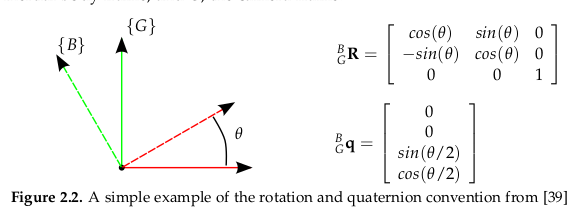
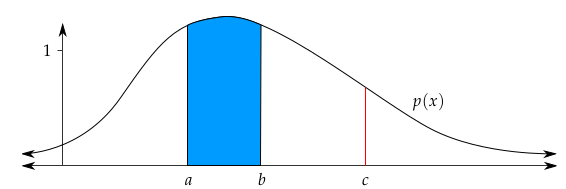

  MSCKF-VIO Tutorial 

# 1 符号表示

|          基本符号           |              例子               |
| :-------------------------: | :-----------------------------: |
|            标量             |               $x$               |
|            向量             |          $\mathbf{x}$           |
|            矩阵             |          $\mathbf{A}$           |
|      连续时间一阶导数       | $\dot{\mathbf{v}} = \mathbf{a}$ |
|      尖冒号表示估计值       |       $\hat{\mathbf{x}}$        |
|         单位四元数          |       $\bar{\mathbf{q}}$        |
|           坐标系            |            B 或者{B}            |
|   坐标系内点用左上方表示    |       $^{G} {\mathbf{p}}$       |
| 坐标系A$\rightarrow$坐标系B |      $_{A}^{B} \mathbf{R}$      |

|        误差符号        |                             例子                             |
| :--------------------: | :----------------------------------------------------------: |
| $\Delta$：两个向量误差 |     $\Delta \mathbf{p} = \mathbf{p} - \hat{\mathbf{p}}$      |
|  $\delta$：四元数误差  |       $\delta \mathbf{\theta} \quad \delta \mathbf{q}$       |
|  波浪号表示一般性误差  | $\tilde{\mathbf{x}} =\mathbf{x} -  \hat{\mathbf{x}} \quad with \quad \mathbf{x} = (\mathbf{p}, \mathbf{\theta})^{T}$ |

* G : 世界坐标系
* C : 相机坐标系
* B : 机体坐标系

# 2 概率状态估计

## 2.1 概率论基础

$P(x = X)$ 在某个范围内的概率等于 概率密度函数$p(x)$ 在该范围内的积分
$$
Pr(a \le x \le b) = \int_{a}^{b} p(x) dx \tag{1}
$$

均值和方差

* $\mathbb{E}(x) = \int x p(x) dx$   
* $Var(x) = \mathbb{E}[x - \mathbb{E}(x)^2] = \sigma^2$

## 2.2 高斯分布

一维高斯密度函数
$$
p(x; \mu, \sigma) = \frac{1}{\sqrt{2 \pi \sigma^2}} exp
\left\{ 
	-\frac{(x- \mu)^2}{2\sigma^2}
\right\} \tag{2}
$$

$N$维高斯密度函数
$$
p(\mathbf{x}; \mathbf{\mu}, \mathbf{\Sigma}) =
\frac{1}{\sqrt{(2\pi)^2|\mathbf{\Sigma}|}} exp
\left\{ 
	-\frac{1}{2} (\mathbf{x}- \mathbf{\mu})^T\Sigma^{-1}(\mathbf{x}- \mathbf{\mu})
\right\} \tag{3}
$$
其中：
$$
\begin{aligned}
	Cov(\mathbf{x}, \mathbf{y}) &= \mathbb{E[(\mathbf{x} - \mathbb{E(x)})(\mathbf{y} - \mathbb{E(y)})]}
\\

Cov\left(\begin{bmatrix}
	x_1 \\
	x_2 \\
	\vdots \\
	x_n
\end{bmatrix}
\right) &=
\begin{bmatrix}
	\sigma_{x_1}^2 & \rho_{(x_1, x_2)}\sigma_{x_1}\sigma_{x_2} & \dots & \rho_{(x_1, x_n)}\sigma_{x_1}\sigma_{x_n}  \\
	\rho_{(x_2, x_1)}\sigma_{x_2}\sigma_{x_1} & \sigma_{x_2}^2 & \dots & \rho_{(x_2, x_n)}\sigma_{x_2}\sigma_{x_n}  \\
	\vdots & \vdots & \ddots & \vdots  \\
	\rho_{(x_n, x_1)}\sigma_{x_n}\sigma_{x_1} &  \rho_{(x_n, x_2)}\sigma_{x_n}\sigma_{x_2} & \dots  & \sigma_{x_n}^2
\end{bmatrix}
\end{aligned} \tag{4}
$$

## 2.3 条件高斯

$$
\begin{bmatrix}
	\mathbf{x} \\
	\mathbf{y} 
\end{bmatrix} =
N(\mathbf{\mu}, \mathbf{\Sigma}) =
\left(
    \begin{bmatrix}
        \mu_x \\
        \mu_y 
    \end{bmatrix},
    \begin{bmatrix}
        \Sigma_{xx} & \Sigma_{xy} \\
        \Sigma_{yx} & \Sigma_{yy} 
    \end{bmatrix}
\right) \tag{5}
$$

边缘化
$$
p(x) = \int p(x,y) dy
	 = \int p(x|y) p(y)dy = N(\mu_x, \Sigma_{xx})
$$
条件概率
$$
p\left(
    \begin{bmatrix}
        x \\
        y 
    \end{bmatrix}
\right) 
=
N\left(
    \begin{bmatrix}
        \mu_x \\
        \mu_y 
    \end{bmatrix},
    \begin{bmatrix}
        \Sigma_{xx} & \Sigma_{xy} \\
        \Sigma_{yx} & \Sigma_{yy} 
    \end{bmatrix}
\right)
=
N\left(
    \begin{bmatrix}
        \mu_x \\
        A\mu_x + b 
    \end{bmatrix},
    \begin{bmatrix}
        \Sigma_{xx} & \Sigma_{xx}A^T \\
        A\Sigma_{xx} & A\Sigma_{xx}A^T + Q 
    \end{bmatrix}
\right) \tag{6}
$$
其中：

* $ \mathbf{x} \sim N(\mu_x, \Sigma_{xx})$
* $y = Ax + b, \quad b \sim N(0, Q)$

# 3 卡尔曼滤波

## 3.1 卡尔曼滤波

初始状态估计
$$
\mathbf{x_0} \sim N(\hat{\mathbf{x}}_{0|0}, \mathbf{\Sigma}_{0|0})
$$
预测
$$
\mathbf{Given}: \mathbf{x}_{t+1} = \mathbf{A}_{t}\mathbf{x}_{t} + \mathbf{B}_{t}\mathbf{u}_{t} + \mathbf{\epsilon}_{t} \quad \mathbf{\epsilon}_{t} \sim N(\mathbf{0}, \mathbf{Q}_t)
\\
\begin{aligned}
	\hat{\mathbf{x}}_{t+1|t} &= \mathbf{A}_{t|t}\hat{\mathbf{x}}_{t} + \mathbf{B}_{t}\mathbf{u}_{t} \\
	\hat{\mathbf{\Sigma}}_{t+1|t} &= \mathbf{A}_{t}\hat{\mathbf{\Sigma}}_{t}\mathbf{A}_{t}^T + \mathbf{Q}_{t}

\end{aligned}
$$
更新
$$
\mathbf{Given}: \mathbf{x}_{t} = \mathbf{C}_{t}\mathbf{x}_{t} + 	\mathbf{\epsilon}_{t} \quad \mathbf{\delta}_{t} \sim N(\mathbf{0}, \mathbf{R}_t)
\\
\begin{aligned}
	\hat{\mathbf{x}}_{t|t} &= \hat{\mathbf{x}}_{t|t-1} + \mathbf{K}_{t}(\mathbf{z}_t - C_t\hat{\mathbf{x}}_{t|t-1}) \\
	\mathbf{\Sigma}_{t|t} &= \mathbf{\Sigma}_{t|t-1} - K_t C_t \mathbf{\Sigma}_{t|t-1} \\
	\mathbf{K}_{t} &= \mathbf{\Sigma}_{t|t-1}C_t^T(C_t\mathbf{\Sigma}_{t|t-1}C_t^T + R_t)^{-1}

\end{aligned}
$$

## 3.2 扩展卡尔曼滤波EKF

系统动态模型
$$
\begin{aligned}
	\mathbf{x}_{t+1} &= f(\mathbf{x}_t, \mathbf{u}_t, \mathbf{w}_t) \quad \mathbf{w}_t \sim N(\mathbf{0}, Q_t) \\
	\mathbf{z}_t &= h(\mathbf{x}_t, \mathbf{v}_t) \quad \quad  \mathbf{v}_t \sim N(\mathbf{0}, R_t)

\end{aligned}
$$
泰勒公式
$$
f(x) = f(a) + f(a)(x- a)
$$

# 4 IMU

# 5 Camera

# 6 MSCKF

